# ClassifyHub

## Logical Architecture Diagrams

### ARCH-1: Design Foundational Monolith with Database

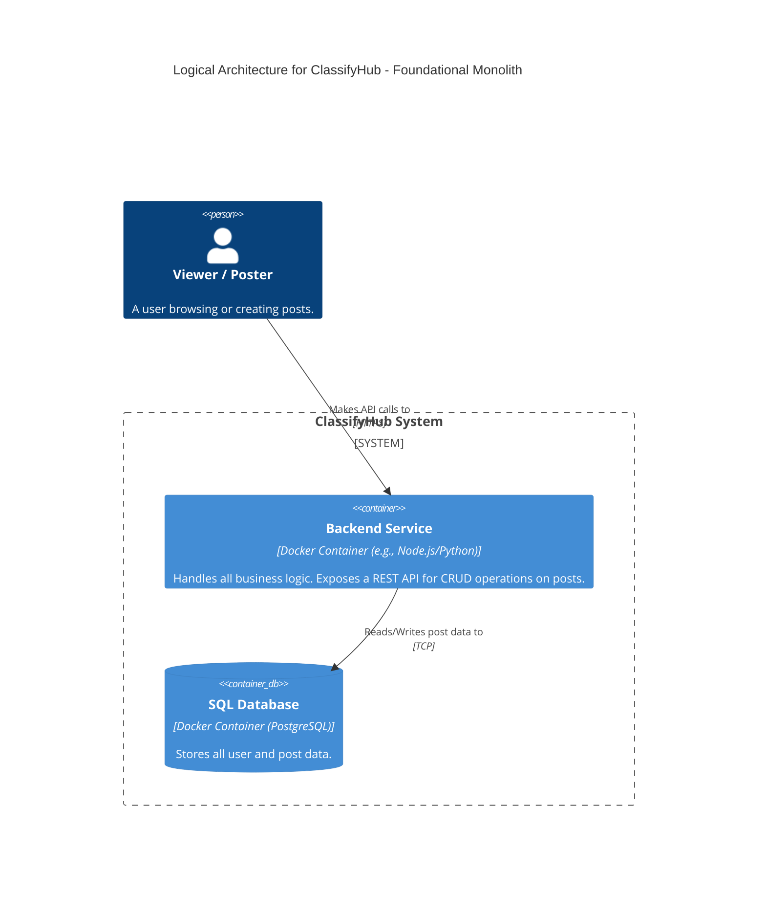
```mermaid
C4Container
    title Logical Architecture for ClassifyHub - Foundational Monolith

    Person(user, "Viewer / Poster", "A user browsing or creating posts.")

    System_Boundary(c1, "ClassifyHub System") {
        Container(backend_service, "Backend Service", "Docker Container (e.g., Node.js/Python)", "Handles all business logic. Exposes a REST API for CRUD operations on posts.")
        ContainerDb(sql_database, "SQL Database", "Docker Container (PostgreSQL)", "Stores all user and post data.")
    }

    Rel(user, backend_service, "Makes API calls to", "HTTPS")
    Rel(backend_service, sql_database, "Reads/Writes post data to", "TCP")
```

### ARCH-2: Design User Authentication

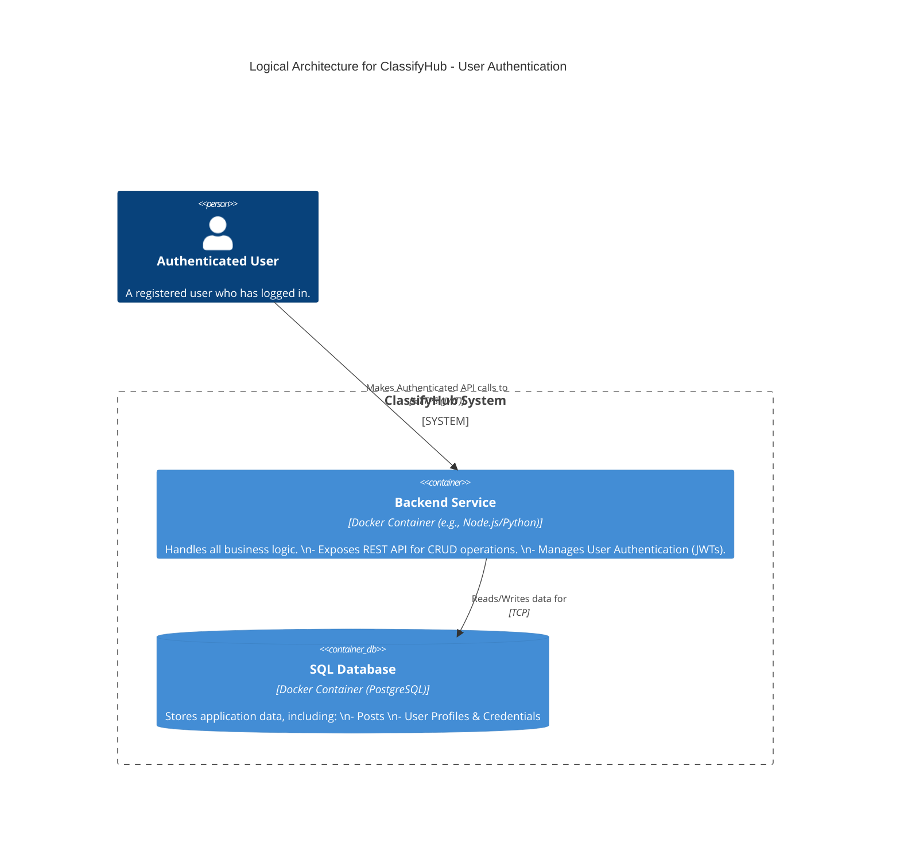
```mermaid
C4Container
    title Logical Architecture for ClassifyHub - User Authentication

    Person(user, "Authenticated User", "A registered user who has logged in.")

    System_Boundary(c1, "ClassifyHub System") {
        Container(backend_service, "Backend Service", "Docker Container (e.g., Node.js/Python)", "Handles all business logic. \n- Exposes REST API for CRUD operations. \n- Manages User Authentication (JWTs).")
        ContainerDb(sql_database, "SQL Database", "Docker Container (PostgreSQL)", "Stores application data, including: \n- Posts \n- User Profiles & Credentials")
    }

    Rel(user, backend_service, "Makes Authenticated API calls to", "HTTPS (JWT)")
    Rel(backend_service, sql_database, "Reads/Writes data for", "TCP")
```

### ARCH-3: Decouple Frontend Application

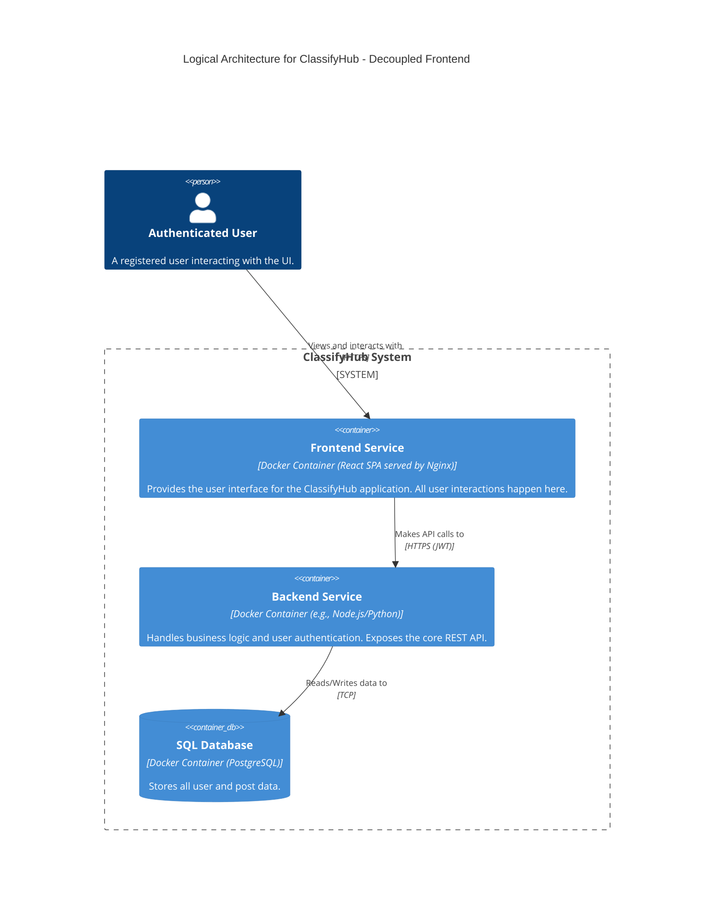
```mermaid
C4Container
    title Logical Architecture for ClassifyHub - Decoupled Frontend

    Person(user, "Authenticated User", "A registered user interacting with the UI.")

    System_Boundary(c1, "ClassifyHub System") {
        Container(frontend_service, "Frontend Service", "Docker Container (React SPA served by Nginx)", "Provides the user interface for the ClassifyHub application. All user interactions happen here.")
        Container(backend_service, "Backend Service", "Docker Container (e.g., Node.js/Python)", "Handles business logic and user authentication. Exposes the core REST API.")
        ContainerDb(sql_database, "SQL Database", "Docker Container (PostgreSQL)", "Stores all user and post data.")
    }

    Rel(user, frontend_service, "Views and interacts with", "HTTPS")
    Rel(frontend_service, backend_service, "Makes API calls to", "HTTPS (JWT)")
    Rel(backend_service, sql_database, "Reads/Writes data to", "TCP")
```

### ARCH-4: Add Object Storage for Image Uploads

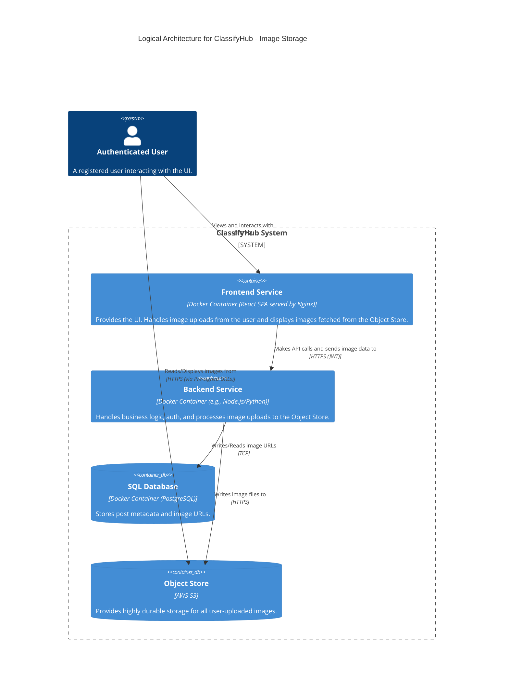
```mermaid
C4Container
    title Logical Architecture for ClassifyHub - Image Storage

    Person(user, "Authenticated User", "A registered user interacting with the UI.")

    System_Boundary(c1, "ClassifyHub System") {
        Container(frontend_service, "Frontend Service", "Docker Container (React SPA served by Nginx)", "Provides the UI. Handles image uploads from the user and displays images fetched from the Object Store.")
        Container(backend_service, "Backend Service", "Docker Container (e.g., Node.js/Python)", "Handles business logic, auth, and processes image uploads to the Object Store.")
        ContainerDb(sql_database, "SQL Database", "Docker Container (PostgreSQL)", "Stores post metadata and image URLs.")
        ContainerDb(object_store, "Object Store", "AWS S3", "Provides highly durable storage for all user-uploaded images.")
    }

    Rel(user, frontend_service, "Views and interacts with", "HTTPS")
    Rel(frontend_service, backend_service, "Makes API calls and sends image data to", "HTTPS (JWT)")
    Rel(backend_service, sql_database, "Writes/Reads image URLs", "TCP")
    Rel(backend_service, object_store, "Writes image files to", "HTTPS")
    Rel(user, object_store, "Reads/Displays images from", "HTTPS (via Pre-signed URLs)")
```

### ARCH-5: Implement Dedicated Search Service

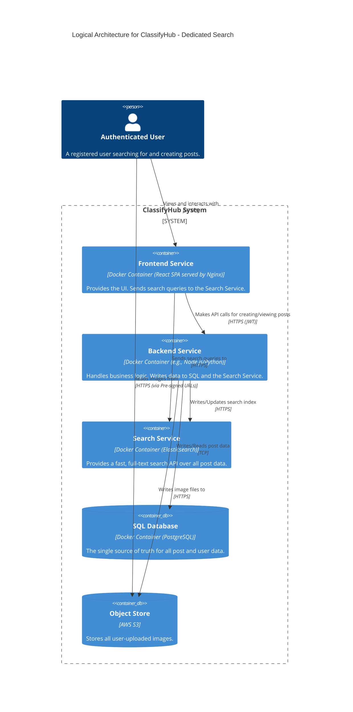
```mermaid
C4Container
    title Logical Architecture for ClassifyHub - Dedicated Search

    Person(user, "Authenticated User", "A registered user searching for and creating posts.")

    System_Boundary(c1, "ClassifyHub System") {
        Container(frontend_service, "Frontend Service", "Docker Container (React SPA served by Nginx)", "Provides the UI. Sends search queries to the Search Service.")
        Container(backend_service, "Backend Service", "Docker Container (e.g., Node.js/Python)", "Handles business logic. Writes data to SQL and the Search Service.")
        Container(search_service, "Search Service", "Docker Container (Elasticsearch)", "Provides a fast, full-text search API over all post data.")
        ContainerDb(sql_database, "SQL Database", "Docker Container (PostgreSQL)", "The single source of truth for all post and user data.")
        ContainerDb(object_store, "Object Store", "AWS S3", "Stores all user-uploaded images.")
    }

    Rel(user, frontend_service, "Views and interacts with", "HTTPS")
    Rel(frontend_service, backend_service, "Makes API calls for creating/viewing posts", "HTTPS (JWT)")
    Rel(frontend_service, search_service, "Sends search queries to", "HTTPS")

    Rel(backend_service, sql_database, "Writes/Reads post data", "TCP")
    Rel(backend_service, search_service, "Writes/Updates search index", "HTTPS")
    Rel(backend_service, object_store, "Writes image files to", "HTTPS")
    
    Rel(user, object_store, "Reads images from", "HTTPS (via Pre-signed URLs)")
```

### ARCH-6: Add a Distributed Caching Layer

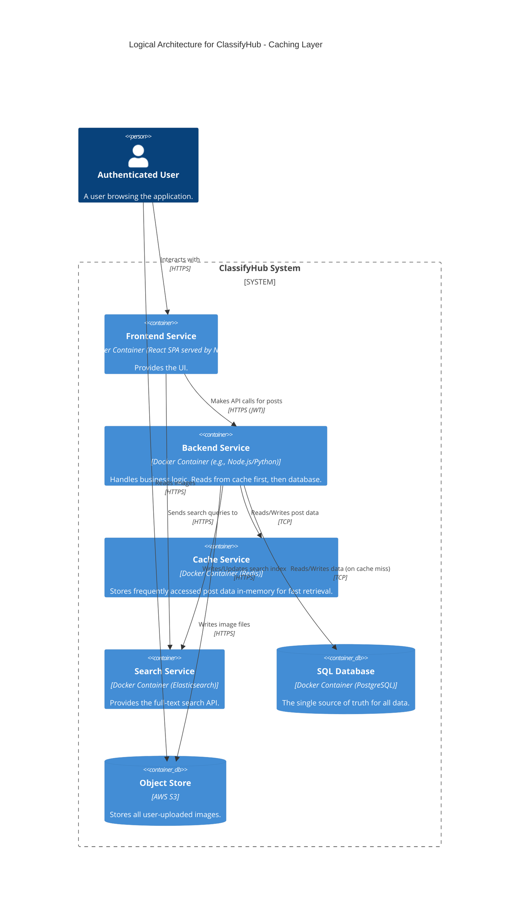
```mermaid
C4Container
    title Logical Architecture for ClassifyHub - Caching Layer

    Person(user, "Authenticated User", "A user browsing the application.")

    System_Boundary(c1, "ClassifyHub System") {
        Container(frontend_service, "Frontend Service", "Docker Container (React SPA served by Nginx)", "Provides the UI.")
        Container(backend_service, "Backend Service", "Docker Container (e.g., Node.js/Python)", "Handles business logic. Reads from cache first, then database.")
        Container(cache_service, "Cache Service", "Docker Container (Redis)", "Stores frequently accessed post data in-memory for fast retrieval.")
        Container(search_service, "Search Service", "Docker Container (Elasticsearch)", "Provides the full-text search API.")
        ContainerDb(sql_database, "SQL Database", "Docker Container (PostgreSQL)", "The single source of truth for all data.")
        ContainerDb(object_store, "Object Store", "AWS S3", "Stores all user-uploaded images.")
    }
    
    Rel(user, frontend_service, "Interacts with", "HTTPS")
    Rel(frontend_service, backend_service, "Makes API calls for posts", "HTTPS (JWT)")
    Rel(frontend_service, search_service, "Sends search queries to", "HTTPS")

    Rel(backend_service, cache_service, "Reads/Writes post data", "TCP")
    Rel(backend_service, sql_database, "Reads/Writes data (on cache miss)", "TCP")
    Rel(backend_service, search_service, "Writes/Updates search index", "HTTPS")
    Rel(backend_service, object_store, "Writes image files", "HTTPS")

    Rel(user, object_store, "Reads images", "HTTPS")
```

### ARCH-7: Introduce an API Gateway

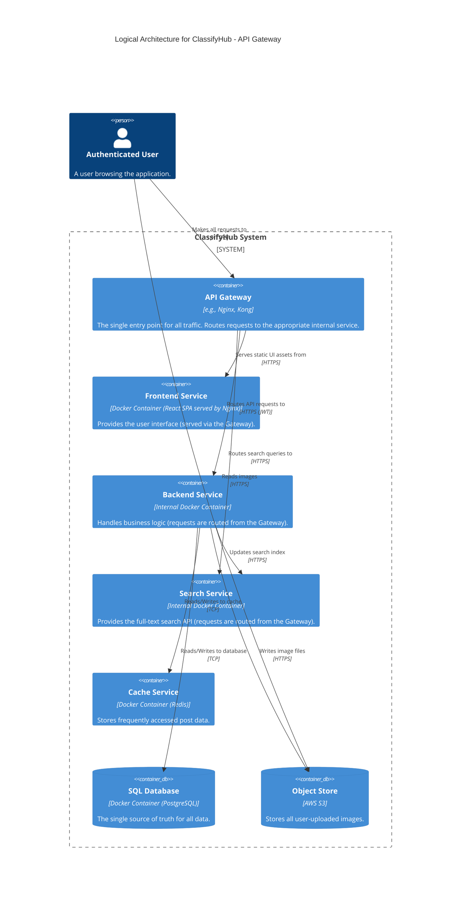
```mermaid
C4Container
    title Logical Architecture for ClassifyHub - API Gateway

    Person(user, "Authenticated User", "A user browsing the application.")

    System_Boundary(c1, "ClassifyHub System") {
        Container(api_gateway, "API Gateway", "e.g., Nginx, Kong", "The single entry point for all traffic. Routes requests to the appropriate internal service.")
        Container(frontend_service, "Frontend Service", "Docker Container (React SPA served by Nginx)", "Provides the user interface (served via the Gateway).")
        Container(backend_service, "Backend Service", "Internal Docker Container", "Handles business logic (requests are routed from the Gateway).")
        Container(search_service, "Search Service", "Internal Docker Container", "Provides the full-text search API (requests are routed from the Gateway).")
        Container(cache_service, "Cache Service", "Docker Container (Redis)", "Stores frequently accessed post data.")
        ContainerDb(sql_database, "SQL Database", "Docker Container (PostgreSQL)", "The single source of truth for all data.")
        ContainerDb(object_store, "Object Store", "AWS S3", "Stores all user-uploaded images.")
    }
    
    Rel(user, api_gateway, "Makes all requests to", "HTTPS")
    Rel(api_gateway, frontend_service, "Serves static UI assets from", "HTTPS")
    Rel(api_gateway, backend_service, "Routes API requests to", "HTTPS (JWT)")
    Rel(api_gateway, search_service, "Routes search queries to", "HTTPS")

    Rel(backend_service, cache_service, "Reads/Writes to cache", "TCP")
    Rel(backend_service, sql_database, "Reads/Writes to database", "TCP")
    Rel(backend_service, search_service, "Updates search index", "HTTPS")
    Rel(backend_service, object_store, "Writes image files", "HTTPS")
    
    Rel(user, object_store, "Reads images", "HTTPS")
```

### ARCH-8: Implement Asynchronous Notification System

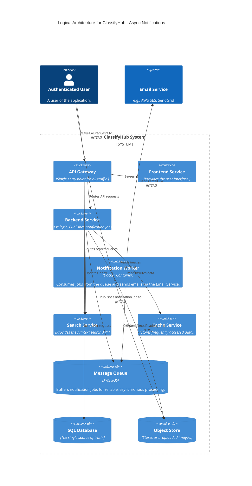
```mermaid
C4Container
    title Logical Architecture for ClassifyHub - Async Notifications

    Person(user, "Authenticated User", "A user of the application.")
    System(email_service, "Email Service", "e.g., AWS SES, SendGrid", "External service that delivers emails.")

    System_Boundary(c1, "ClassifyHub System") {
        Container(api_gateway, "API Gateway", "Single entry point for all traffic.")
        Container(frontend_service, "Frontend Service", "Provides the user interface.")
        Container(backend_service, "Backend Service", "Handles business logic. Publishes notification jobs to the queue.")
        Container(notification_worker, "Notification Worker", "Docker Container", "Consumes jobs from the queue and sends emails via the Email Service.")
        Container(search_service, "Search Service", "Provides the full-text search API.")
        Container(cache_service, "Cache Service", "Stores frequently accessed data.")
        ContainerDb(message_queue, "Message Queue", "AWS SQS", "Buffers notification jobs for reliable, asynchronous processing.")
        ContainerDb(sql_database, "SQL Database", "The single source of truth.")
        ContainerDb(object_store, "Object Store", "Stores user-uploaded images.")
    }
    
    Rel(user, api_gateway, "Makes all requests to", "HTTPS")
    Rel(api_gateway, frontend_service, "Serves UI")
    Rel(api_gateway, backend_service, "Routes API requests")
    Rel(api_gateway, search_service, "Routes search queries")

    Rel(backend_service, message_queue, "Publishes notification job to", "HTTPS")
    Rel(notification_worker, message_queue, "Consumes notification job from", "HTTPS")
    Rel(notification_worker, email_service, "Sends email via", "HTTPS")

    Rel_Back(sql_database, backend_service, "Reads/Writes data")
    Rel_Back(cache_service, backend_service, "Reads/Writes data")
    Rel_Back(search_service, backend_service, "Updates index")
    Rel_Back(object_store, backend_service, "Writes files")

    Rel(user, object_store, "Reads images", "HTTPS")
```

### ARCH-9: Integrate a Content Delivery Network (CDN)

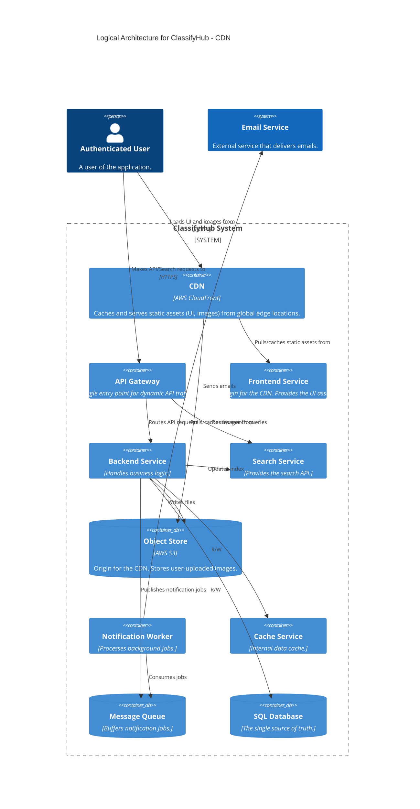
```mermaid
C4Container
    title Logical Architecture for ClassifyHub - CDN

    Person(user, "Authenticated User", "A user of the application.")

    System_Boundary(c1, "ClassifyHub System") {
        Container(cdn, "CDN", "AWS CloudFront", "Caches and serves static assets (UI, images) from global edge locations.")
        Container(api_gateway, "API Gateway", "Single entry point for dynamic API traffic.")
        Container(frontend_service, "Frontend Service", "Origin for the CDN. Provides the UI assets.")
        Container(backend_service, "Backend Service", "Handles business logic.")
        Container(search_service, "Search Service", "Provides the search API.")
        ContainerDb(object_store, "Object Store", "AWS S3", "Origin for the CDN. Stores user-uploaded images.")
        
        %% --- Other Internal Components ---
        Container(notification_worker, "Notification Worker", "Processes background jobs.")
        Container(cache_service, "Cache Service", "Internal data cache.")
        ContainerDb(message_queue, "Message Queue", "Buffers notification jobs.")
        ContainerDb(sql_database, "SQL Database", "The single source of truth.")
    }

    System(email_service, "Email Service", "External service that delivers emails.")

    Rel(user, cdn, "Loads UI and images from", "HTTPS")
    Rel(user, api_gateway, "Makes API/Search requests to", "HTTPS")

    Rel(cdn, frontend_service, "Pulls/caches static assets from")
    Rel(cdn, object_store, "Pulls/caches images from")
    
    Rel(api_gateway, backend_service, "Routes API requests")
    Rel(api_gateway, search_service, "Routes search queries")

    Rel(backend_service, message_queue, "Publishes notification jobs")
    Rel(notification_worker, message_queue, "Consumes jobs")
    Rel(notification_worker, email_service, "Sends emails")

    Rel_Back(sql_database, backend_service, "R/W")
    Rel_Back(cache_service, backend_service, "R/W")
    Rel_Back(search_service, backend_service, "Updates index")
    Rel_Back(object_store, backend_service, "Writes files")
```

### ARCH-10: Scale the Database with Read Replicas

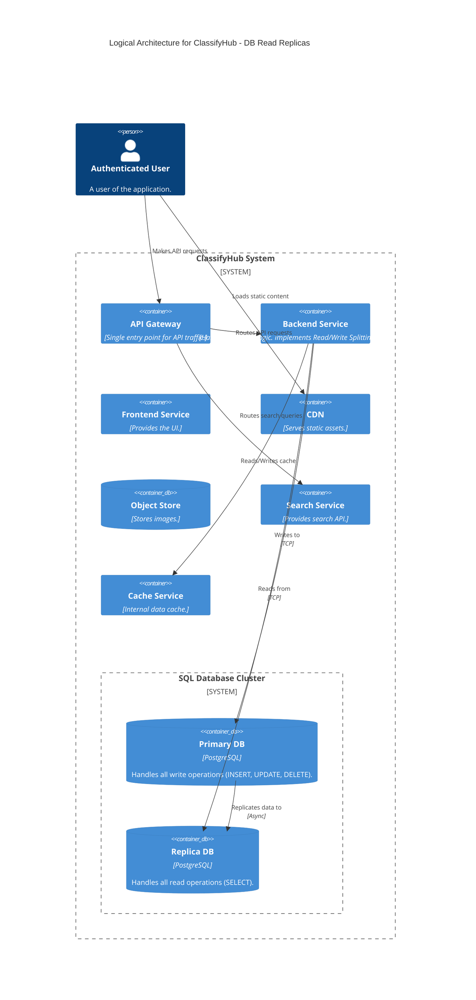
```mermaid
C4Container
    title Logical Architecture for ClassifyHub - DB Read Replicas

    Person(user, "Authenticated User", "A user of the application.")

    System_Boundary(c1, "ClassifyHub System") {
        Container(api_gateway, "API Gateway", "Single entry point for API traffic.")
        Container(backend_service, "Backend Service", "Handles business logic. Implements Read/Write Splitting for the database.")

        System_Boundary(db_cluster, "SQL Database Cluster") {
            ContainerDb(primary_db, "Primary DB", "PostgreSQL", "Handles all write operations (INSERT, UPDATE, DELETE).")
            ContainerDb(replica_db, "Replica DB", "PostgreSQL", "Handles all read operations (SELECT).")
        }
        
        %% --- Other Components for context ---
        Container(frontend_service, "Frontend Service", "Provides the UI.")
        Container(cdn, "CDN", "Serves static assets.")
        ContainerDb(object_store, "Object Store", "Stores images.")
        Container(search_service, "Search Service", "Provides search API.")
        Container(cache_service, "Cache Service", "Internal data cache.")
    }

    Rel(user, cdn, "Loads static content")
    Rel(user, api_gateway, "Makes API requests")
    Rel(api_gateway, backend_service, "Routes API requests")
    Rel(api_gateway, search_service, "Routes search queries")

    Rel(backend_service, primary_db, "Writes to", "TCP")
    Rel(backend_service, replica_db, "Reads from", "TCP")
    Rel(primary_db, replica_db, "Replicates data to", "Async")
    
    Rel(backend_service, cache_service, "Reads/Writes cache")
```

### ARCH-11: Add Rate Limiting at the API Gateway

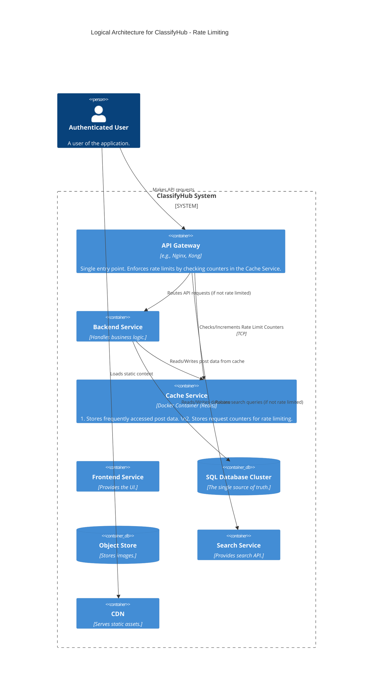
```mermaid
C4Container
    title Logical Architecture for ClassifyHub - Rate Limiting

    Person(user, "Authenticated User", "A user of the application.")

    System_Boundary(c1, "ClassifyHub System") {
        Container(api_gateway, "API Gateway", "e.g., Nginx, Kong", "Single entry point. Enforces rate limits by checking counters in the Cache Service.")
        Container(backend_service, "Backend Service", "Handles business logic.")
        Container(cache_service, "Cache Service", "Docker Container (Redis)", "1. Stores frequently accessed post data. \n2. Stores request counters for rate limiting.")
        
        %% --- Other Components for context ---
        Container(frontend_service, "Frontend Service", "Provides the UI.")
        ContainerDb(sql_database, "SQL Database Cluster", "The single source of truth.")
        ContainerDb(object_store, "Object Store", "Stores images.")
        Container(search_service, "Search Service", "Provides search API.")
        Container(cdn, "CDN", "Serves static assets.")
    }

    Rel(user, cdn, "Loads static content")
    Rel(user, api_gateway, "Makes API requests")

    Rel(api_gateway, cache_service, "Checks/Increments Rate Limit Counters", "TCP")
    Rel(api_gateway, backend_service, "Routes API requests (if not rate limited)")
    Rel(api_gateway, search_service, "Routes search queries (if not rate limited)")

    Rel(backend_service, sql_database, "Reads/Writes database")
    Rel(backend_service, cache_service, "Reads/Writes post data from cache")
```

### ARCH-12: Design for High Availability (Multi-AZ Deployment)

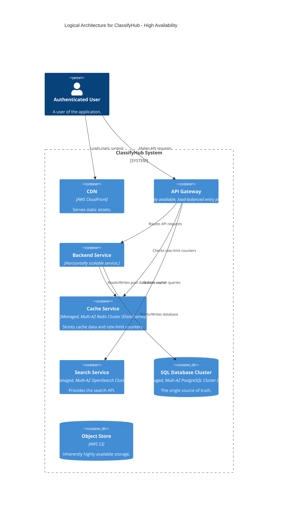
```mermaid
C4Container
    title Logical Architecture for ClassifyHub - High Availability

    Person(user, "Authenticated User", "A user of the application.")

    System_Boundary(c1, "ClassifyHub System") {
        Container(cdn, "CDN", "AWS CloudFront", "Serves static assets.")
        Container(api_gateway, "API Gateway", "Highly available, load-balanced entry point.")
        Container(backend_service, "Backend Service", "Horizontally scalable service.")
        Container(cache_service, "Cache Service", "Managed, Multi-AZ Redis Cluster (ElastiCache)", "Stores cache data and rate-limit counters.")
        Container(search_service, "Search Service", "Managed, Multi-AZ OpenSearch Cluster", "Provides the search API.")
        ContainerDb(sql_database, "SQL Database Cluster", "Managed, Multi-AZ PostgreSQL Cluster (RDS)", "The single source of truth.")
        ContainerDb(object_store, "Object Store", "AWS S3", "Inherently highly available storage.")
    }

    Rel(user, cdn, "Loads static content")
    Rel(user, api_gateway, "Makes API requests")
    Rel(api_gateway, backend_service, "Routes API requests")
    Rel(api_gateway, search_service, "Routes search queries")
    Rel(api_gateway, cache_service, "Checks rate-limit counters")

    Rel(backend_service, sql_database, "Reads/Writes database")
    Rel(backend_service, cache_service, "Reads/Writes post data from cache")
```

### ARCH-13: Implement a Centralized Observability Stack

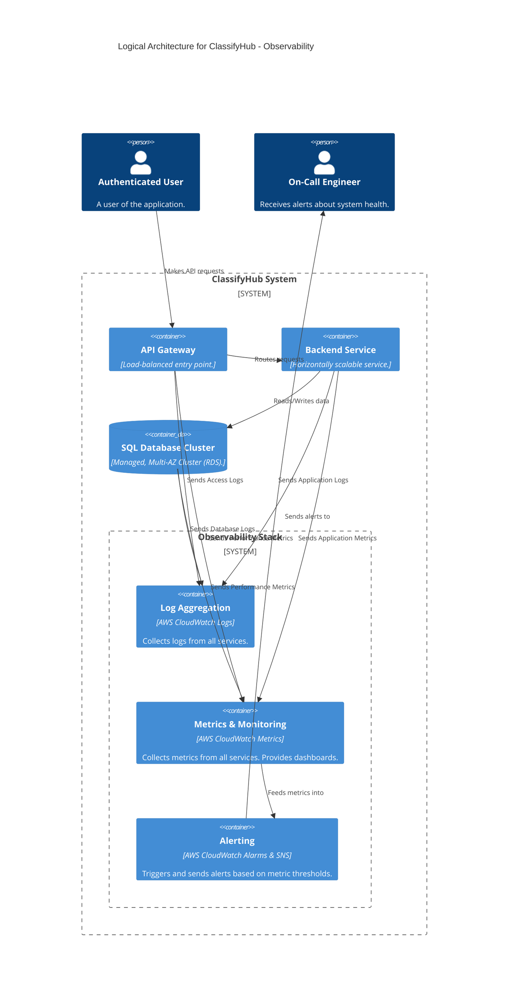
```mermaid
C4Container
    title Logical Architecture for ClassifyHub - Observability

    Person(user, "Authenticated User", "A user of the application.")
    Person(engineer, "On-Call Engineer", "Receives alerts about system health.")

    System_Boundary(c1, "ClassifyHub System") {
        Container(api_gateway, "API Gateway", "Load-balanced entry point.")
        Container(backend_service, "Backend Service", "Horizontally scalable service.")
        
        System_Boundary(observability_stack, "Observability Stack") {
            Container(logging, "Log Aggregation", "AWS CloudWatch Logs", "Collects logs from all services.")
            Container(metrics, "Metrics & Monitoring", "AWS CloudWatch Metrics", "Collects metrics from all services. Provides dashboards.")
            Container(alerting, "Alerting", "AWS CloudWatch Alarms & SNS", "Triggers and sends alerts based on metric thresholds.")
        }
        
        %% --- Other components for context ---
        ContainerDb(sql_database, "SQL Database Cluster", "Managed, Multi-AZ Cluster (RDS).")
    }

    Rel(user, api_gateway, "Makes API requests")
    Rel(api_gateway, backend_service, "Routes requests")
    Rel(backend_service, sql_database, "Reads/Writes data")

    Rel(api_gateway, logging, "Sends Access Logs")
    Rel(api_gateway, metrics, "Sends Performance Metrics")
    
    Rel(backend_service, logging, "Sends Application Logs")
    Rel(backend_service, metrics, "Sends Application Metrics")
    
    Rel(sql_database, logging, "Sends Database Logs")
    Rel(sql_database, metrics, "Sends Performance Metrics")
    
    Rel(metrics, alerting, "Feeds metrics into")
    Rel(alerting, engineer, "Sends alerts to")
```

### ARCH-14: Implement Geo-Partitioning and Routing

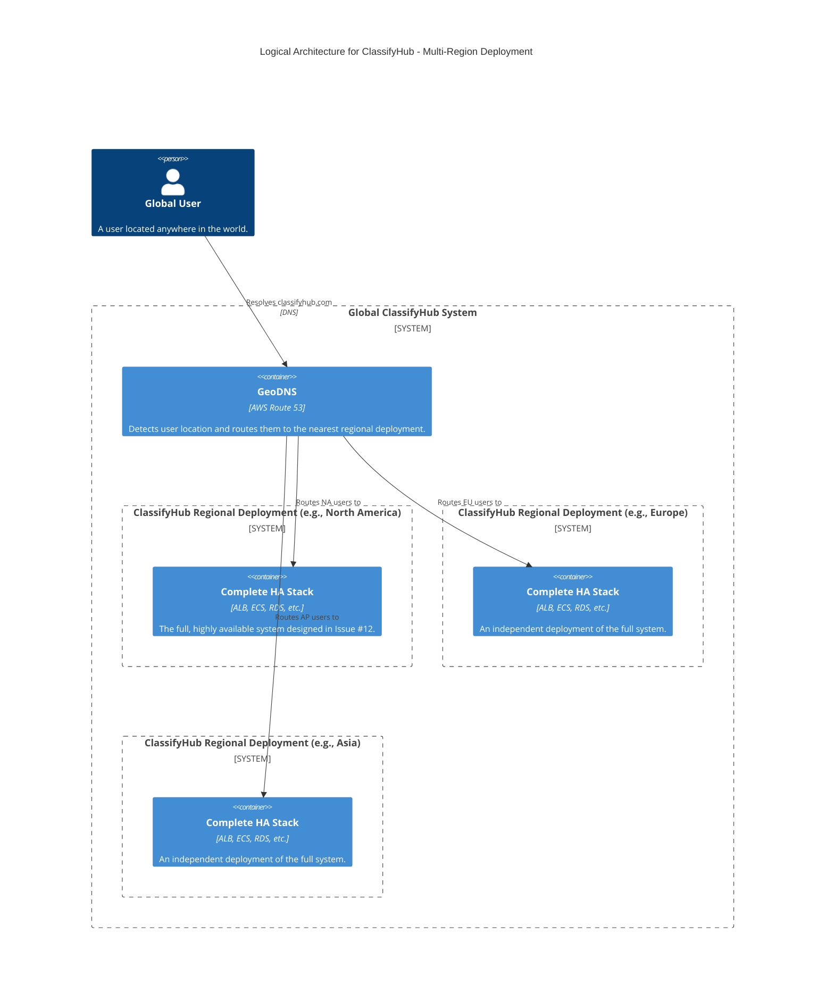
```mermaid
C4Container
    title Logical Architecture for ClassifyHub - Multi-Region Deployment

    Person(user, "Global User", "A user located anywhere in the world.")

    System_Boundary(c1, "Global ClassifyHub System") {
        Container(geo_dns, "GeoDNS", "AWS Route 53", "Detects user location and routes them to the nearest regional deployment.")

        System_Boundary(region1, "ClassifyHub Regional Deployment (e.g., North America)") {
             Container(regional_system_1, "Complete HA Stack", "ALB, ECS, RDS, etc.", "The full, highly available system designed in Issue #12.")
        }
        
        System_Boundary(region2, "ClassifyHub Regional Deployment (e.g., Europe)") {
             Container(regional_system_2, "Complete HA Stack", "ALB, ECS, RDS, etc.", "An independent deployment of the full system.")
        }

        System_Boundary(region3, "ClassifyHub Regional Deployment (e.g., Asia)") {
             Container(regional_system_3, "Complete HA Stack", "ALB, ECS, RDS, etc.", "An independent deployment of the full system.")
        }
    }

    Rel(user, geo_dns, "Resolves classifyhub.com", "DNS")
    
    %% FIX: Relationships now point to the container inside the boundary, not the boundary itself.
    Rel(geo_dns, regional_system_1, "Routes NA users to")
    Rel(geo_dns, regional_system_2, "Routes EU users to")
    Rel(geo_dns, regional_system_3, "Routes AP users to")
```

### Overall Logical Architecture Diagram

```mermaid
C4Container
    title Overall Logical Architecture for ClassifyHub (Final)

    Person(user, "Authenticated User", "A user of the application.")
    Person(engineer, "On-Call Engineer", "Receives alerts about system health.")
    System(email_service, "Email Service", "External service that delivers emails.")

    System_Boundary(c1, "ClassifyHub System") {
    
        %% --- Edge & Entry Points ---
        Container(cdn, "CDN", "AWS CloudFront", "Caches and serves static assets (UI, images) from global edge locations.")
        Container(api_gateway, "API Gateway", "Highly available, load-balanced single entry point for all API traffic. Enforces rate limiting.")

        %% --- Core Application Services ---
        Container(frontend_service, "Frontend Service", "Provides the UI assets (Origin for CDN).")
        Container(backend_service, "Backend Service", "Horizontally scalable service. Handles business logic, auth, and data orchestration.")
        Container(search_service, "Search Service", "Managed, Multi-AZ OpenSearch Cluster. Provides the full-text search API.")
        Container(notification_worker, "Notification Worker", "Processes background jobs asynchronously from the message queue.")

        %% --- Data & Messaging Stores ---
        ContainerDb(sql_database, "SQL Database Cluster", "Managed, Multi-AZ PostgreSQL (RDS). The single source of truth.")
        ContainerDb(cache_service, "Cache Service", "Managed, Multi-AZ Redis (ElastiCache). Stores cached data and rate-limit counters.")
        ContainerDb(object_store, "Object Store", "AWS S3. Stores all user-uploaded images.")
        ContainerDb(message_queue, "Message Queue", "AWS SQS. Buffers notification jobs for reliable, asynchronous processing.")

        %% --- Observability Stack (Cross-Cutting Concern) ---
        System_Boundary(observability_stack, "Observability Stack") {
            Container(logging, "Log Aggregation", "AWS CloudWatch Logs", "Collects logs from all services.")
            Container(metrics, "Metrics & Monitoring", "AWS CloudWatch Metrics", "Collects metrics and provides dashboards.")
            Container(alerting, "Alerting", "AWS CloudWatch Alarms & SNS", "Triggers and sends alerts based on metric thresholds.")
        }
    }

    %% --- Relationships ---

    %% 1. User Interaction Flow
    Rel(user, cdn, "Loads UI and Images", "HTTPS")
    Rel(user, api_gateway, "Makes API/Search Requests", "HTTPS")

    %% 2. Edge & Routing
    Rel(cdn, frontend_service, "Pulls UI Assets (Origin)")
    Rel(cdn, object_store, "Pulls Images (Origin)")
    Rel(api_gateway, backend_service, "Routes API Requests")
    Rel(api_gateway, search_service, "Routes Search Queries")
    Rel(api_gateway, cache_service, "Checks Rate-Limit Counters")

    %% 3. Backend Service Orchestration
    Rel(backend_service, sql_database, "Reads/Writes Data")
    Rel(backend_service, cache_service, "Reads/Writes Post Cache")
    Rel(backend_service, search_service, "Writes to Search Index")
    Rel(backend_service, object_store, "Writes Image Files")
    Rel(backend_service, message_queue, "Publishes Notification Job")

    %% 4. Asynchronous Notification Flow
    Rel(notification_worker, message_queue, "Consumes Job")
    Rel(notification_worker, email_service, "Sends Email")
    
    %% 5. Observability Data Flow (Examples)
    Rel(backend_service, logging, "Sends Logs")
    Rel(backend_service, metrics, "Sends Metrics")
    Rel(sql_database, metrics, "Sends Performance Metrics")
    Rel(metrics, alerting, "Feeds Metrics Into")
    Rel(alerting, engineer, "Sends Alerts To")
```

## Physical Architecture Diagrams

### ARCH-1: Design Foundational Monolith with Database

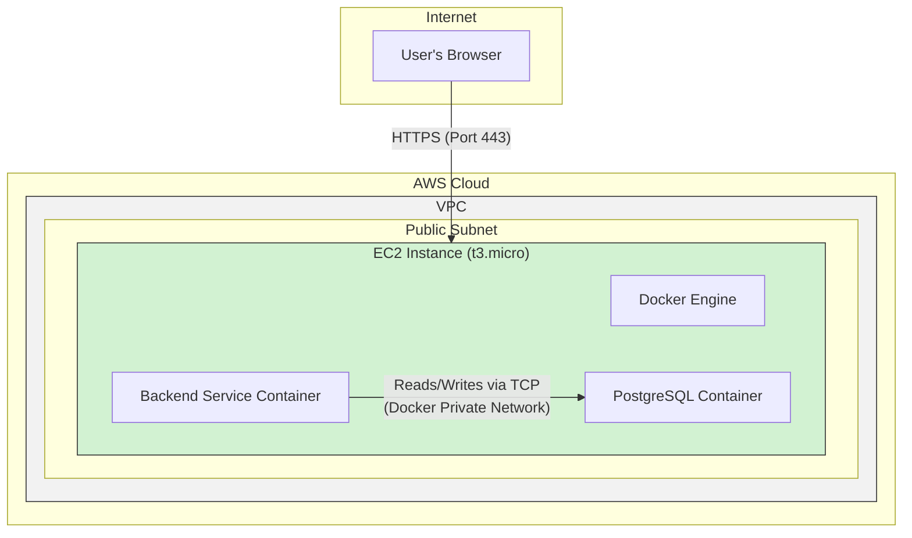
```mermaid
graph TD
    %% --- Define Actors ---
    subgraph "Internet"
        user_client["User's Browser"]
    end

    %% --- Define Cloud Infrastructure ---
    subgraph "AWS Cloud"
        subgraph "VPC"
            subgraph "Public Subnet"
                %% The EC2 Instance is the host for our containers
                subgraph ec2_instance ["EC2 Instance (t3.micro)"]
                    docker["Docker Engine"]
                    
                    %% Containers are managed by Docker on the EC2 host
                    backend_container["Backend Service Container"]
                    db_container["PostgreSQL Container"]
                end
            end
        end
    end

    %% --- Define Relationships ---
    %% 1. User traffic hits the public IP of the EC2 Instance.
    %%    The instance's networking forwards traffic from port 443 to the backend container.
    user_client -- "HTTPS (Port 443)" --> ec2_instance

    %% 2. The Backend Service communicates with the Database over the internal, private Docker network.
    backend_container -- "Reads/Writes via TCP <br/>(Docker Private Network)" --> db_container

    %% --- Styling ---
    classDef aws_cloud fill:#FF9900,stroke:#333,stroke-width:2px;
    classDef vpc fill:#f2f2f2,stroke:#333;
    classDef ec2 fill:#D2F2D2,stroke:#333;

    class AWS_Cloud aws_cloud
    class VPC vpc
    class ec2_instance ec2
```

### ARCH-2: Design User Authentication

```mermaid
graph TD
    %% --- Define Actors ---
    subgraph "Internet"
        user_client["User's Browser"]
    end

    %% --- Define Cloud Infrastructure ---
    subgraph "AWS Cloud"
        subgraph "VPC"
            subgraph "Public Subnet"
                %% The EC2 Instance is the host for our containers
                subgraph ec2_instance ["EC2 Instance (t3.micro)"]
                    docker["Docker Engine"]
                    
                    %% Containers are managed by Docker on the EC2 host
                    backend_container["Backend Service Container"]
                    db_container["PostgreSQL Container"]
                end
            end
        end
    end

    %% --- Define Relationships ---
    %% 1. User traffic hits the public IP of the EC2 Instance.
    %%    The instance's networking forwards traffic from port 443 to the backend container.
    user_client -- "HTTPS (Port 443)" --> ec2_instance

    %% 2. The Backend Service communicates with the Database over the internal, private Docker network.
    backend_container -- "Reads/Writes via TCP <br/>(Docker Private Network)" --> db_container

    %% --- Styling ---
    classDef aws_cloud fill:#FF9900,stroke:#333,stroke-width:2px;
    classDef vpc fill:#f2f2f2,stroke:#333;
    classDef ec2 fill:#D2F2D2,stroke:#333;

    class AWS_Cloud aws_cloud
    class VPC vpc
    class ec2_instance ec2
```

### ARCH-3: Decouple Frontend Application

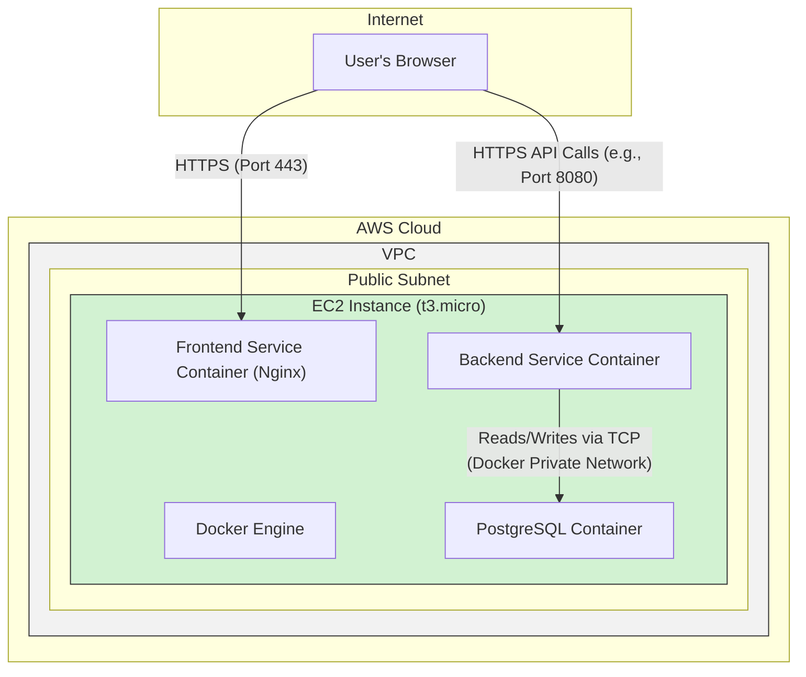
```mermaid
graph TD
    %% --- Define Actors ---
    subgraph "Internet"
        user_client["User's Browser"]
    end

    %% --- Define Cloud Infrastructure ---
    subgraph "AWS Cloud"
        subgraph "VPC"
            subgraph "Public Subnet"
                subgraph ec2_instance ["EC2 Instance (t3.micro)"]
                    docker["Docker Engine"]
                    
                    %% All three containers are co-located on the same host
                    frontend_container["Frontend Service Container (Nginx)"]
                    backend_container["Backend Service Container"]
                    db_container["PostgreSQL Container"]
                end
            end
        end
    end

    %% --- Define Relationships ---
    %% 1. User's browser loads the SPA from the Frontend container.
    user_client -- "HTTPS (Port 443)" --> frontend_container

    %% 2. The SPA (in the browser) makes API calls to the Backend container.
    %% Note: This implies the EC2 instance forwards traffic from another port (e.g., 8080) to the backend.
    user_client -- "HTTPS API Calls (e.g., Port 8080)" --> backend_container

    %% 3. The Backend communicates with the Database.
    backend_container -- "Reads/Writes via TCP <br/>(Docker Private Network)" --> db_container

    %% --- Styling ---
    classDef aws_cloud fill:#FF9900,stroke:#333,stroke-width:2px;
    classDef vpc fill:#f2f2f2,stroke:#333;
    classDef ec2 fill:#D2F2D2,stroke:#333;

    class AWS_Cloud aws_cloud
    class VPC vpc
    class ec2_instance ec2
```

### ARCH-4: Add Object Storage for Image Uploads

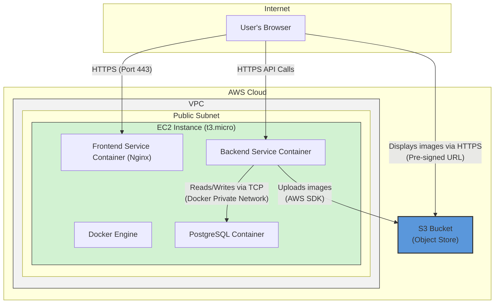
```mermaid
graph TD
    %% --- Define Actors ---
    subgraph "Internet"
        user_client["User's Browser"]
    end

    %% --- Define Cloud Infrastructure ---
    subgraph "AWS Cloud"
        s3_bucket["S3 Bucket <br/> (Object Store)"]

        subgraph "VPC"
            subgraph "Public Subnet"
                subgraph ec2_instance ["EC2 Instance (t3.micro)"]
                    docker["Docker Engine"]
                    
                    frontend_container["Frontend Service Container (Nginx)"]
                    backend_container["Backend Service Container"]
                    db_container["PostgreSQL Container"]
                end
            end
        end
    end

    %% --- Define Relationships ---
    %% 1. User loads the SPA from the Frontend.
    user_client -- "HTTPS (Port 443)" --> frontend_container

    %% 2. The SPA sends API requests (including image uploads) to the Backend.
    user_client -- "HTTPS API Calls" --> backend_container

    %% 3. The Backend uploads the received image file to S3.
    backend_container -- "Uploads images <br/> (AWS SDK)" --> s3_bucket

    %% 4. The Backend writes the image URL/key to the Database.
    backend_container -- "Reads/Writes via TCP <br/>(Docker Private Network)" --> db_container
    
    %% 5. The SPA receives the image URL and the browser renders the image directly from S3.
    user_client -- "Displays images via HTTPS <br/> (Pre-signed URL)" --> s3_bucket

    %% --- Styling ---
    classDef aws_cloud fill:#FF9900,stroke:#333,stroke-width:2px;
    classDef vpc fill:#f2f2f2,stroke:#333;
    classDef ec2 fill:#D2F2D2,stroke:#333;
    classDef s3 fill:#5A97DB,stroke:#333,stroke-width:2px;

    class AWS_Cloud aws_cloud
    class VPC vpc
    class ec2_instance ec2
    class s3_bucket s3
```

### ARCH-5: Implement Dedicated Search Service

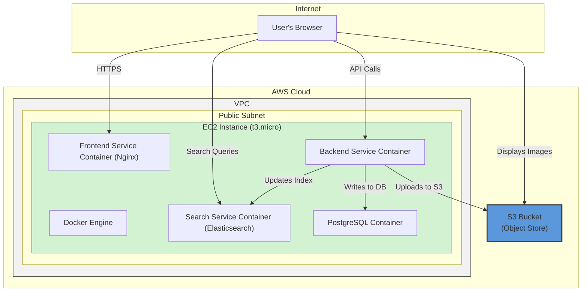
```mermaid
graph TD
    %% --- Define Actors ---
    subgraph "Internet"
        user_client["User's Browser"]
    end

    %% --- Define Cloud Infrastructure ---
    subgraph "AWS Cloud"
        s3_bucket["S3 Bucket <br/> (Object Store)"]

        subgraph "VPC"
            subgraph "Public Subnet"
                subgraph ec2_instance ["EC2 Instance (t3.micro)"]
                    docker["Docker Engine"]
                    
                    frontend_container["Frontend Service Container (Nginx)"]
                    backend_container["Backend Service Container"]
                    search_container["Search Service Container (Elasticsearch)"]
                    db_container["PostgreSQL Container"]
                end
            end
        end
    end

    %% --- Define Relationships ---
    %% 1. User interacts with Frontend.
    user_client -- "HTTPS" --> frontend_container

    %% 2. SPA makes calls to Backend for posts and Search for queries.
    user_client -- "API Calls" --> backend_container
    user_client -- "Search Queries" --> search_container

    %% 3. Backend performs dual writes.
    backend_container -- "Writes to DB" --> db_container
    backend_container -- "Updates Index" --> search_container

    %% 4. Backend handles image uploads.
    backend_container -- "Uploads to S3" --> s3_bucket
    
    %% 5. User's browser renders images from S3.
    user_client -- "Displays Images" --> s3_bucket

    %% --- Styling ---
    classDef aws_cloud fill:#FF9900,stroke:#333,stroke-width:2px;
    classDef vpc fill:#f2f2f2,stroke:#333;
    classDef ec2 fill:#D2F2D2,stroke:#333;
    classDef s3 fill:#5A97DB,stroke:#333,stroke-width:2px;

    class AWS_Cloud aws_cloud
    class VPC vpc
    class ec2_instance ec2
    class s3_bucket s3
```

### ARCH-6: Add a Distributed Caching Layer

```mermaid
graph TD
    %% --- Define Actors ---
    subgraph "Internet"
        user_client["User's Browser"]
    end

    %% --- Define Cloud Infrastructure ---
    subgraph "AWS Cloud"
        s3_bucket["S3 Bucket <br/> (Object Store)"]

        subgraph "VPC"
            subgraph "Public Subnet"
                subgraph ec2_instance ["EC2 Instance (t3.micro)"]
                    docker["Docker Engine"]
                    
                    frontend_container["Frontend Service Container"]
                    backend_container["Backend Service Container"]
                    cache_container["Cache Service Container (Redis)"]
                    search_container["Search Service Container"]
                    db_container["PostgreSQL Container"]
                end
            end
        end
    end

    %% --- Define Relationships ---
    %% User Interactions
    user_client -- "HTTPS" --> frontend_container
    user_client -- "API Calls" --> backend_container
    user_client -- "Search Queries" --> search_container
    user_client -- "Displays Images" --> s3_bucket

    %% Backend Interactions
    backend_container -- "1.Check Cache" --> cache_container
    backend_container -- "2.Read/Write DB <br/> (on cache miss)" --> db_container
    backend_container -- "3.Write to Cache" --> cache_container
    backend_container -- "Updates Index" --> search_container
    backend_container -- "Uploads to S3" --> s3_bucket
    
    %% --- Styling ---
    classDef aws_cloud fill:#FF9900,stroke:#333,stroke-width:2px;
    classDef vpc fill:#f2f2f2,stroke:#333;
    classDef ec2 fill:#D2F2D2,stroke:#333;
    classDef s3 fill:#5A97DB,stroke:#333,stroke-width:2px;

    class AWS_Cloud aws_cloud
    class VPC vpc
    class ec2_instance ec2
    class s3_bucket s3
```

### ARCH-7: Introduce an API Gateway

```mermaid
graph TD
    %% --- Define Actors ---
    subgraph "Internet"
        user_client["User's Browser"]
    end

    %% --- Define Cloud Infrastructure ---
    subgraph "AWS Cloud"
        s3_bucket["S3 Bucket <br/> (Object Store)"]

        subgraph "VPC"
            subgraph "Public Subnet"
                subgraph ec2_instance ["EC2 Instance (t3.micro)"]
                    docker["Docker Engine"]
                    
                    api_gateway_container["API Gateway Container"]
                    frontend_container["Frontend Service Container"]
                    backend_container["Backend Service Container"]
                    cache_container["Cache Service Container"]
                    search_container["Search Service Container"]
                    db_container["PostgreSQL Container"]
                end
            end
        end
    end

    %% --- Define Relationships ---
    %% 1. ALL user traffic now goes through the API Gateway
    user_client -- "HTTPS (Port 443)" --> api_gateway_container
    
    %% 2. Gateway routes traffic to internal services
    api_gateway_container -- "Serves UI" --> frontend_container
    api_gateway_container -- "Routes API Calls" --> backend_container
    api_gateway_container -- "Routes Search Queries" --> search_container

    %% 3. Backend still performs its functions
    backend_container -- "Check Cache" --> cache_container
    backend_container -- "R/W DB" --> db_container
    backend_container -- "Update Index" --> search_container
    backend_container -- "Uploads to S3" --> s3_bucket
    
    %% 4. User still displays images directly from S3
    user_client -- "Displays Images" --> s3_bucket

    %% --- Styling ---
    classDef aws_cloud fill:#FF9900,stroke:#333,stroke-width:2px;
    classDef vpc fill:#f2f2f2,stroke:#333;
    classDef ec2 fill:#D2F2D2,stroke:#333;
    classDef s3 fill:#5A97DB,stroke:#333,stroke-width:2px;

    class AWS_Cloud aws_cloud
    class VPC vpc
    class ec2_instance ec2
    class s3_bucket s3
```

### ARCH-8: Implement Asynchronous Notification System

```mermaid
graph TD
    %% --- Define Actors & External Systems ---
    subgraph "Internet"
        user_client["User's Browser"]
    end
    
    email_service["External Email Service <br/> (e.g., AWS SES)"]

    %% --- Define Cloud Infrastructure ---
    subgraph AWS_Cloud ["AWS Cloud"]
        s3_bucket["S3 Bucket"]
        sqs_queue["SQS Queue <br/> (Message Queue)"]

        subgraph VPC ["VPC"]
            subgraph Public_Subnet ["Public Subnet"]
                subgraph ec2_instance ["EC2 Instance (t3.micro)"]
                    docker["Docker Engine"]
                    
                    api_gateway_container["API Gateway"]
                    frontend_container["Frontend Service"]
                    backend_container["Backend Service"]
                    notification_worker_container["Notification Worker"]
                    cache_container["Cache Service"]
                    search_container["Search Service"]
                    db_container["PostgreSQL"]
                end
            end
        end
    end

    %% --- Define Relationships ---
    %% 1. User -> Gateway -> Services
    user_client -- "HTTPS" --> api_gateway_container
    api_gateway_container -- "Routes to" --> frontend_container & backend_container & search_container
    
    %% 2. Async Notification Flow
    backend_container -- "1.Publish Job" --> sqs_queue
    notification_worker_container -- "2.Consume Job" --> sqs_queue
    notification_worker_container -- "3.Send Email" --> email_service

    %% 3. Backend Service internal interactions (defined directly)
    backend_container -- "R/W Cache" --> cache_container
    backend_container -- "R/W DB" --> db_container
    backend_container -- "Update Index" --> search_container
    backend_container -- "Uploads to S3" --> s3_bucket
    
    %% 4. User reads images directly from S3
    user_client -- "Displays Images" --> s3_bucket

    %% --- Styling ---
    classDef aws_cloud fill:#FF9900,stroke:#333,stroke-width:2px;
    classDef managed_service fill:#5A97DB,stroke:#333,stroke-width:2px;
    classDef vpc_style fill:#f2f2f2,stroke:#333;
    classDef ec2 fill:#D2F2D2,stroke:#333;
    
    class AWS_Cloud aws_cloud
    class VPC,Public_Subnet vpc_style
    class ec2_instance ec2
    class s3_bucket,sqs_queue managed_service
```

### ARCH-9: Integrate a Content Delivery Network (CDN)

```mermaid
graph TD
    %% --- Define Actors & External Systems ---
    subgraph "Internet"
        user_client["User's Browser"]
    end
    
    email_service["External Email Service"]

    %% --- Define Cloud Infrastructure ---
    subgraph AWS_Cloud ["AWS Cloud"]
        cloudfront["CloudFront Distribution (CDN)"]
        s3_bucket["S3 Bucket"]
        sqs_queue["SQS Queue"]

        subgraph VPC ["VPC"]
            subgraph Public_Subnet ["Public Subnet"]
                subgraph ec2_instance ["EC2 Instance (t3.micro)"]
                    docker["Docker Engine"]
                    
                    api_gateway_container["API Gateway"]
                    frontend_container["Frontend Service"]
                    backend_container["Backend Service"]
                    notification_worker_container["Notification Worker"]
                    cache_container["Cache Service"]
                    search_container["Search Service"]
                    db_container["PostgreSQL"]
                end
            end
        end
    end

    %% --- Define Relationships ---
    %% 1. User traffic is now split
    user_client -- "Loads UI & Images (HTTPS)" --> cloudfront
    user_client -- "API & Search Calls (HTTPS)" --> api_gateway_container

    %% 2. CloudFront origins
    cloudfront -- "Origin 1: Pulls UI assets" --> api_gateway_container
    cloudfront -- "Origin 2: Pulls images" --> s3_bucket

    %% 3. API Gateway routing (unchanged)
    api_gateway_container -- "Routes to" --> frontend_container & backend_container & search_container
    
    %% 4. Async Notification Flow (unchanged)
    backend_container -- "Publish" --> sqs_queue
    notification_worker_container -- "Consume" --> sqs_queue
    notification_worker_container -- "Send" --> email_service

    %% --- Styling ---
    classDef aws_cloud fill:#FF9900,stroke:#333,stroke-width:2px;
    classDef managed_service fill:#5A97DB,stroke:#333,stroke-width:2px;
    classDef cdn_style fill:#4CAF50,stroke:#333,stroke-width:2px;
    classDef vpc_style fill:#f2f2f2,stroke:#333;
    classDef ec2 fill:#D2F2D2,stroke:#333;
    
    class AWS_Cloud aws_cloud
    class VPC,Public_Subnet vpc_style
    class ec2_instance ec2
    class s3_bucket,sqs_queue managed_service
    class cloudfront cdn_style
```

### ARCH-10: Scale the Database with Read Replicas

```mermaid
graph TD
    %% --- Define Actors ---
    subgraph "Internet"
        user_client["User's Browser"]
    end

    %% --- Define Cloud Infrastructure ---
    subgraph AWS_Cloud ["AWS Cloud"]
        cloudfront["CloudFront (CDN)"]
        s3_bucket["S3 Bucket"]
        sqs_queue["SQS Queue"]

        subgraph VPC ["VPC"]
            subgraph Public_Subnet ["Public Subnet"]
                subgraph ec2_instance ["EC2 Instance (t3.micro)"]
                    docker["Docker Engine"]
                    
                    api_gateway_container["API Gateway"]
                    backend_container["Backend Service"]
                    db_primary_container["Primary DB Container"]
                    db_replica_container["Replica DB Container"]
                    
                    %% Other containers for context
                    frontend_container["Frontend Service"]
                    notification_worker_container["Notification Worker"]
                    cache_container["Cache Service"]
                    search_container["Search Service"]
                end
            end
        end
    end

    %% --- Define Relationships ---
    %% 1. Edge Traffic (unchanged)
    user_client -- "Loads Assets" --> cloudfront
    user_client -- "API Calls" --> api_gateway_container

    %% 2. Gateway Routing (unchanged)
    api_gateway_container -- "Routes to" --> backend_container & search_container

    %% 3. NEW: Backend DB Read/Write Splitting
    backend_container -- "WRITES" --> db_primary_container
    backend_container -- "READS" --> db_replica_container
    
    %% 4. NEW: DB Replication
    db_primary_container -- "Async Replication" --> db_replica_container
    
    %% Other backend interactions
    backend_container -- "R/W Cache" --> cache_container
    backend_container -- "Update Index" --> search_container
    backend_container -- "Publish Job" --> sqs_queue

    %% --- Styling ---
    classDef aws_cloud fill:#FF9900,stroke:#333,stroke-width:2px;
    classDef managed_service fill:#5A97DB,stroke:#333,stroke-width:2px;
    classDef cdn_style fill:#4CAF50,stroke:#333,stroke-width:2px;
    classDef vpc_style fill:#f2f2f2,stroke:#333;
    classDef ec2 fill:#D2F2D2,stroke:#333;
    
    class AWS_Cloud aws_cloud
    class VPC,Public_Subnet vpc_style
    class ec2_instance ec2
    class s3_bucket,sqs_queue managed_service
    class cloudfront cdn_style
```

### ARCH-11: Add Rate Limiting at the API Gateway

```mermaid
graph TD
    %% --- Define Actors ---
    subgraph "Internet"
        user_client["User's Browser"]
    end

    %% --- Define Cloud Infrastructure ---
    subgraph AWS_Cloud ["AWS Cloud"]
        cloudfront["CloudFront (CDN)"]
        s3_bucket["S3 Bucket"]
        sqs_queue["SQS Queue"]

        subgraph VPC ["VPC"]
            subgraph Public_Subnet ["Public Subnet"]
                subgraph ec2_instance ["EC2 Instance (t3.micro)"]
                    docker["Docker Engine"]
                    
                    api_gateway_container["API Gateway"]
                    backend_container["Backend Service"]
                    cache_container["Cache Service (Redis)"]
                    
                    %% Other containers for context
                    db_primary_container["Primary DB"]
                    db_replica_container["Replica DB"]
                    frontend_container["Frontend Service"]
                    notification_worker_container["Notification Worker"]
                    search_container["Search Service"]
                end
            end
        end
    end

    %% --- Define Relationships ---
    %% 1. Edge Traffic (unchanged)
    user_client -- "Loads Assets" --> cloudfront
    user_client -- "API Calls" --> api_gateway_container

    %% 2. NEW: API Gateway Rate Limiting Flow
    api_gateway_container -- "1.Check/Increment Counter" --> cache_container
    api_gateway_container -- "2.Route Request <br/>(if allowed)" --> backend_container & search_container
    
    %% 3. Backend DB & Cache interactions
    backend_container -- "WRITES" --> db_primary_container
    backend_container -- "READS" --> db_replica_container
    backend_container -- "R/W Post Cache" --> cache_container

    %% --- Styling ---
    classDef aws_cloud fill:#FF9900,stroke:#333,stroke-width:2px;
    classDef managed_service fill:#5A97DB,stroke:#333,stroke-width:2px;
    classDef cdn_style fill:#4CAF50,stroke:#333,stroke-width:2px;
    classDef vpc_style fill:#f2f2f2,stroke:#333;
    classDef ec2 fill:#D2F2D2,stroke:#333;
    
    class AWS_Cloud aws_cloud
    class VPC,Public_Subnet vpc_style
    class ec2_instance ec2
    class s3_bucket,sqs_queue managed_service
    class cloudfront cdn_style
```

### ARCH-12: Design for High Availability (Multi-AZ Deployment)

```mermaid
graph TD
    subgraph "Internet"
        user_client["User's Browser"]
    end

    subgraph AWS_Cloud ["AWS Cloud"]
        cloudfront["CloudFront (CDN)"]
        s3_bucket["S3 Bucket"]

        subgraph VPC ["VPC"]
            %% --- Application Load Balancer in Public Subnets ---
            subgraph Public_Subnets
                direction LR
                alb["Application <br/> Load Balancer"]
            end

            %% --- AZ 1 ---
            subgraph AZ1 ["Availability Zone 1"]
                subgraph Private_Subnet_1 ["Private Subnet"]
                    ecs_tasks_1["ECS Tasks <br/> (API Gateway, Backend, <br/> Search, Worker, etc.)"]
                    rds_primary["RDS Primary"]
                    elasticache_1["ElastiCache Node"]
                    opensearch_1["OpenSearch Node"]
                end
            end
            
            %% --- AZ 2 ---
            subgraph AZ2 ["Availability Zone 2"]
                subgraph Private_Subnet_2 ["Private Subnet"]
                    ecs_tasks_2["ECS Tasks <br/> (API Gateway, Backend, <br/> Search, Worker, etc.)"]
                    rds_replica["RDS Standby <br/> Replica"]
                    elasticache_2["ElastiCache Node"]
                    opensearch_2["OpenSearch Node"]
                end
            end
        end
    end
    
    %% --- Define Relationships ---
    user_client -- "Static Assets" --> cloudfront
    user_client -- "API Traffic" --> alb

    alb -- "Distributes Traffic" --> ecs_tasks_1 & ecs_tasks_2
    
    ecs_tasks_1 & ecs_tasks_2 -- "Writes" --> rds_primary
    ecs_tasks_1 & ecs_tasks_2 -- "Reads" --> rds_replica
    
    ecs_tasks_1 & ecs_tasks_2 -- "R/W Cache" --> elasticache_1 & elasticache_2
    ecs_tasks_1 & ecs_tasks_2 -- "R/W Search" --> opensearch_1 & opensearch_2

    rds_primary -- "Sync Replication" --> rds_replica

    %% --- Styling ---
    classDef aws_cloud fill:#FF9900,stroke:#333;
    classDef managed_service fill:#5A97DB,stroke:#333;
    classDef cdn_style fill:#4CAF50,stroke:#333;
    classDef vpc_style fill:#f2f2f2,stroke:#333;
    classDef az fill:#DDEBF8,stroke:#333;
    
    class AWS_Cloud aws_cloud
    class VPC,Public_Subnets,Private_Subnet_1,Private_Subnet_2 vpc_style
    class AZ1,AZ2 az
    class s3_bucket,rds_primary,rds_replica,elasticache_1,elasticache_2,opensearch_1,opensearch_2 managed_service
    class cloudfront cdn_style
```

### ARCH-13: Implement a Centralized Observability Stack

```mermaid
graph TD
    subgraph "Internet"
        user_client["User's Browser"]
        on_call_engineer["On-Call Engineer"]
    end

    subgraph AWS_Cloud ["AWS Cloud"]
        cloudfront["CloudFront (CDN)"]
        s3_bucket["S3 Bucket"]
        
        %% Observability Services
        subgraph Observability
            direction LR
            cloudwatch["CloudWatch <br/>(Logs, Metrics, Alarms)"]
            sns["SNS Topic"]
        end

        subgraph VPC ["VPC"]
            subgraph Public_Subnets
                alb["Application Load Balancer"]
            end

            subgraph AZ1 ["Availability Zone 1"]
                subgraph Private_Subnet_1 ["Private Subnet"]
                    ecs_tasks_1["ECS Tasks"]
                    rds_primary["RDS Primary"]
                end
            end
            
            subgraph AZ2 ["Availability Zone 2"]
                subgraph Private_Subnet_2 ["Private Subnet"]
                    ecs_tasks_2["ECS Tasks"]
                    rds_replica["RDS Standby Replica"]
                end
            end
        end
    end
    
    %% --- Define Relationships ---
    user_client -- "API Traffic" --> alb
    
    %% All infrastructure sends data TO CloudWatch
    alb --> cloudwatch
    ecs_tasks_1 --> cloudwatch
    ecs_tasks_2 --> cloudwatch
    rds_primary --> cloudwatch
    rds_replica --> cloudwatch

    %% Alerting Flow
    cloudwatch -- "1. Triggers Alarm" --> sns
    sns -- "2. Sends Notification" --> on_call_engineer

    %% --- Styling ---
    classDef aws_cloud fill:#FF9900,stroke:#333;
    classDef vpc_style fill:#f2f2f2,stroke:#333;
    classDef az fill:#DDEBF8,stroke:#333;
    classDef obs fill:#9C27B0,stroke:white,color:white;
    
    class AWS_Cloud aws_cloud
    class VPC,Public_Subnets,Private_Subnet_1,Private_Subnet_2 vpc_style
    class AZ1,AZ2 az
    class cloudwatch,sns obs
```

### ARCH-14: Implement Geo-Partitioning and Routing

```mermaid
graph TD
    subgraph "Internet"
        user_na["User in <br/> North America"]
        user_eu["User in <br/> Europe"]
        user_ap["User in <br/> Asia"]
    end

    subgraph AWS_Global ["AWS Global Infrastructure"]
        route53["Route 53 <br/> (GeoDNS)"]
    end
    
    subgraph AWS_Region_NA ["AWS Region: us-east-1"]
        regional_stack_na["[Regional HA Stack] <br/> ALB, ECS, RDS, etc."]
    end

    subgraph AWS_Region_EU ["AWS Region: eu-west-1"]
        regional_stack_eu["[Regional HA Stack] <br/> ALB, ECS, RDS, etc."]
    end
    
    subgraph AWS_Region_AP ["AWS Region: ap-southeast-1"]
        regional_stack_ap["[Regional HA Stack] <br/> ALB, ECS, RDS, etc."]
    end

    %% --- Define Relationships ---
    user_na & user_eu & user_ap -- "DNS Lookup for classifyhub.com" --> route53

    route53 -- "Routes to nearest region" --> user_na & user_eu & user_ap

    user_na -- "Connects to" --> regional_stack_na
    user_eu -- "Connects to" --> regional_stack_eu
    user_ap -- "Connects to" --> regional_stack_ap
    
    %% --- Styling ---
    classDef global fill:#9C27B0,stroke:white,color:white;
    classDef region fill:#FF9900,stroke:#333;

    class AWS_Global global
    class AWS_Region_NA,AWS_Region_EU,AWS_Region_AP region
```

### Overall Physical Architecture Diagram

```mermaid
graph TD
    %% --- Define Actors & External Systems ---
    subgraph "Internet"
        user_client["User's Browser"]
        on_call_engineer["On-Call Engineer"]
    end
    
    email_service["External Email Service"]

    %% --- Define Cloud Infrastructure ---
    subgraph AWS_Cloud ["AWS Cloud"]
    
        %% 1. Global & Edge Services
        route53["Route 53 (GeoDNS)"]
        cloudfront["CloudFront (CDN)"]

        %% 2. Regional Managed Services (outside VPC for clarity)
        s3_bucket["S3 Bucket"]
        sqs_queue["SQS Queue"]
        subgraph Observability
            direction LR
            cloudwatch["CloudWatch <br/>(Logs, Metrics, Alarms)"]
            sns["SNS Topic"]
        end

        %% 3. The Core VPC for a Single Region
        subgraph VPC ["VPC"]
            
            %% Public Subnets with Load Balancer
            subgraph Public_Subnets ["Public Subnets (Multi-AZ)"]
                alb["Application <br/> Load Balancer"]
            end

            %% Availability Zone 1
            subgraph AZ1 ["Availability Zone 1"]
                subgraph Private_Subnet_1 ["Private Subnet"]
                    ecs_tasks_1["ECS Tasks <br/> (API GW, Backend, Frontend, <br/> Search, Notification Worker)"]
                    rds_primary["RDS Primary"]
                    elasticache_1["ElastiCache Node"]
                    opensearch_1["OpenSearch Node"]
                end
            end
            
            %% Availability Zone 2
            subgraph AZ2 ["Availability Zone 2"]
                subgraph Private_Subnet_2 ["Private Subnet"]
                    ecs_tasks_2["ECS Tasks <br/> (API GW, Backend, Frontend, <br/> Search, Notification Worker)"]
                    rds_standby["RDS Standby <br/> Replica"]
                    elasticache_2["ElastiCache Node"]
                    opensearch_2["OpenSearch Node"]
                end
            end
        end
    end
    
    %% --- Define Relationships ---
    %% 1. Initial User Connection
    user_client -- "1.DNS Lookup" --> route53
    route53 -- "2.Routes to nearest region's ALB/CDN" --> user_client

    %% 2. Traffic Flow to Edge
    user_client -- "3a.Loads Static Assets" --> cloudfront
    user_client -- "3b.API & Search Traffic" --> alb

    %% 3. CDN to Origin
    cloudfront -- "Pulls Images" --> s3_bucket
    cloudfront -- "Pulls UI Assets" --> alb

    %% 4. Load Balancer to Application
    alb -- "Distributes Traffic" --> ecs_tasks_1 & ecs_tasks_2
    
    %% 5. Application to Data Stores
    ecs_tasks_1 & ecs_tasks_2 -- "Writes (Primary)" --> rds_primary
    ecs_tasks_1 & ecs_tasks_2 -- "Reads (Standby can be used for reads)" --> rds_standby
    ecs_tasks_1 & ecs_tasks_2 -- "R/W Cache" --> elasticache_1 & elasticache_2
    ecs_tasks_1 & ecs_tasks_2 -- "R/W Search Index" --> opensearch_1 & opensearch_2
    rds_primary -- "Sync Replication" --> rds_standby
    
    %% 6. Async & Object Storage Flow
    ecs_tasks_1 & ecs_tasks_2 -- "Publishes Job" --> sqs_queue
    ecs_tasks_1 & ecs_tasks_2 -- "Consumes Job & Sends Email" --> sqs_queue & email_service
    ecs_tasks_1 & ecs_tasks_2 -- "Uploads to" --> s3_bucket

    %% 7. Observability Flow
    alb & ecs_tasks_1 & ecs_tasks_2 & rds_primary & rds_standby -- "Sends Logs & Metrics" --> cloudwatch
    cloudwatch -- "Triggers Alarm" --> sns
    sns -- "Sends Notification" --> on_call_engineer

    %% --- Styling ---
    classDef aws_cloud fill:#FF9900,stroke:#333;
    classDef global fill:#9C27B0,stroke:white,color:white;
    classDef cdn_style fill:#4CAF50,stroke:#333;
    classDef vpc_style fill:#f2f2f2,stroke:#333;
    classDef az fill:#DDEBF8,stroke:#333;
    classDef managed_service fill:#5A97DB,stroke:#333;
    classDef obs fill:#9C27B0,stroke:white,color:white;
    
    class AWS_Cloud aws_cloud
    class VPC,Public_Subnets,Private_Subnet_1,Private_Subnet_2 vpc_style
    class AZ1,AZ2 az
    class s3_bucket,sqs_queue,rds_primary,rds_standby,elasticache_1,elasticache_2,opensearch_1,opensearch_2 managed_service
    class cloudfront cdn_style
    class route53 global
    class cloudwatch,sns obs
```
