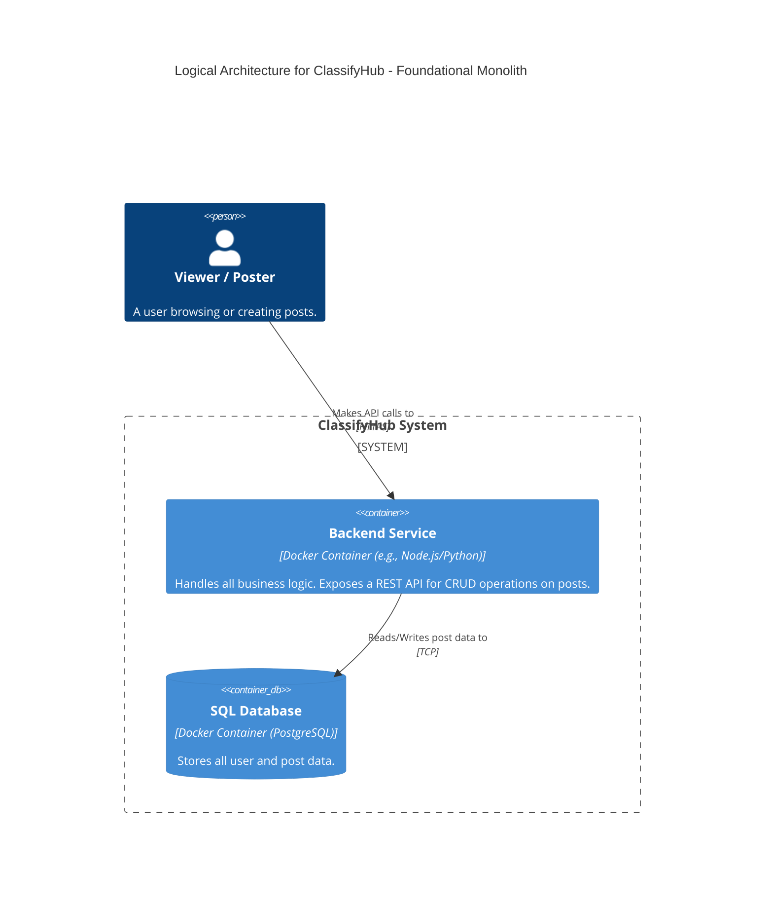
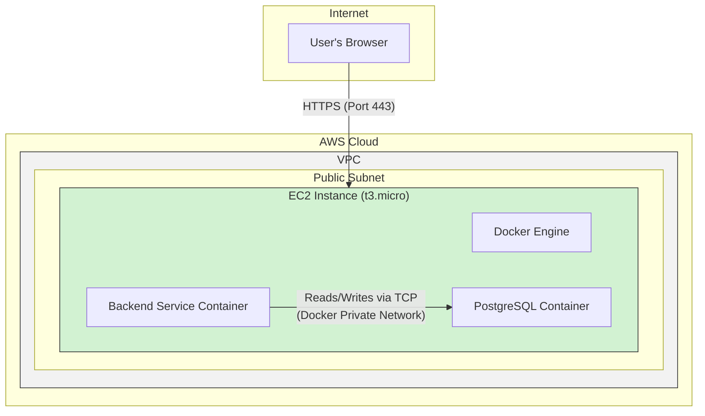

#### **ARCH-1: Design Foundational Monolith with Database**

*   **Problem:** We need to establish the baseline architecture for ClassifyHub. To begin, the system requires a fundamental capability for users to create and read text-only posts, with a persistent storage mechanism.

*   **Solution:** Design a minimal, single-service architecture. This will consist of a monolithic **Backend Service** container that exposes a REST API for all post-related operations (CRUD). This service will connect directly to a single **SQL Database** container for all data persistence. This entire system will be designed to run within a containerized environment (e.g., on a single host with Docker).

*   **Trade-offs:**
    *   **Pros:**
        *   **Simplicity:** Extremely simple to design, develop, deploy, and debug.
        *   **Rapid Development:** Fastest way to achieve a working MVP. No overhead from distributed system complexities.
        *   **Low Initial Cost:** Can run on a single, inexpensive virtual machine.
    *   **Cons:**
        *   **No Scalability:** Tightly coupled components. The application and database scale together, which is inefficient. This design will not meet our final NFRs.
        *   **Single Point of Failure:** If the single host or container fails, the entire system goes down.
        *   **Technology Lock-in:** All business logic is in one place, making it harder to adopt new technologies for different parts of the system later.

---

#### **Logical View (C4 Component Diagram)**

This C4 Container diagram shows the primary logical building blocks (containers) inside our system and how a user interacts with them.

---

#### **Physical View (AWS Deployment Diagram)**

This diagram illustrates how the logical components are deployed onto physical (or virtualized) infrastructure. For this initial stage, we assume the simplest possible deployment: a single virtual machine running Docker.

---

#### **Component-to-Resource Mapping Table**

| Logical Component | Physical Resource | Rationale |
| :--- | :--- | :--- |
| **Backend Service** | Docker Container on a single EC2 Instance | Provides a consistent, isolated environment for the application. A single EC2 instance is the most cost-effective and simple starting point for an MVP. |
| **SQL Database** | Docker Container (PostgreSQL) on the same EC2 Instance | Co-locating the database with the application on the same host minimizes network latency and simplifies configuration for the initial design. Using a standard PostgreSQL container ensures portability. |
