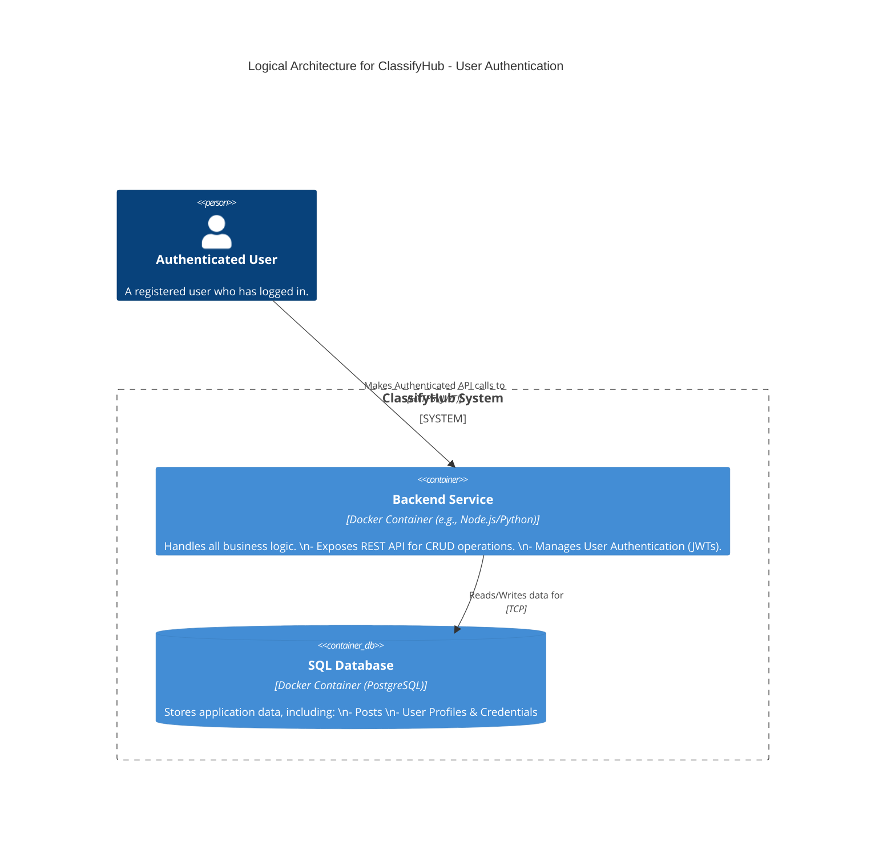
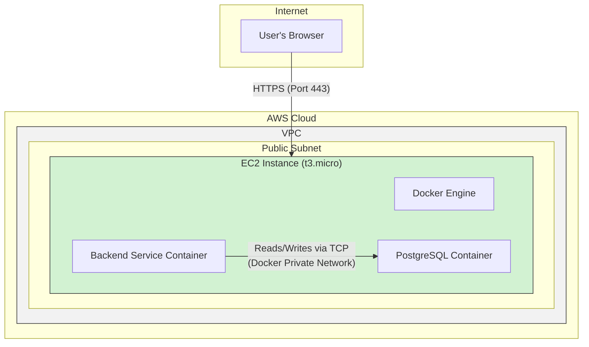

#### **ARCH-2: Introduce User Authentication**

*   **Problem:** The current system is anonymous and does not meet the PRD requirement for users to register and log in (`FR-1.1.1`, `FR-1.1.2`). Without a concept of user identity, we cannot attribute posts to a creator or secure post creation endpoints.

*   **Solution:** We will evolve the existing **Backend Service** to include user management and authentication logic. It will be responsible for handling user registration (storing user credentials securely), login (validating credentials), and issuing stateless JWTs (JSON Web Tokens) upon successful authentication. The **SQL Database** schema will be updated to include a `Users` table for storing user profiles and hashed passwords. All API endpoints related to creating or managing posts will now require a valid JWT.

*   **Trade-offs:**
    *   **Pros:**
        *   **Maintains Simplicity:** Integrates a critical feature without adding a new service, keeping the operational overhead low.
        *   **Co-location:** Authentication and business logic are tightly coupled, which can be simpler to reason about in a small application.
    *   **Cons:**
        *   **Increased Monolith Responsibility:** The Backend Service is becoming more complex. Over time, this makes it harder to maintain and test.
        *   **Coupled Scaling:** The resources for authentication logic are scaled with the entire monolith, which may be inefficient in the future. A dedicated auth service could be scaled independently.

---

#### **Logical View (C4 Component Diagram)**

This diagram evolves from Issue #1. The `Backend Service` now explicitly includes authentication responsibilities, and the `SQL Database` stores user data.

---

#### **Physical View (AWS Deployment Diagram)**

**Note:** The physical deployment for this issue remains **unchanged**. The new authentication logic is a software update to the existing `Backend Service Container`. It does not require any new infrastructure at this stage.

---

#### **Component-to-Resource Mapping Table**

The mapping remains the same as in Issue #1. The `Backend Service` container simply gains more responsibilities while running on the same underlying resource.

| Logical Component | Physical Resource | Rationale |
| :--- | :--- | :--- |
| **Backend Service** | Docker Container on a single EC2 Instance | Provides a consistent, isolated environment. The container's image will be updated to include the new authentication code, but its physical host remains the same. |
| **SQL Database** | Docker Container (PostgreSQL) on the same EC2 Instance | Co-located for simplicity and low latency. The database schema will be updated, but the container itself and its host are unchanged. |
