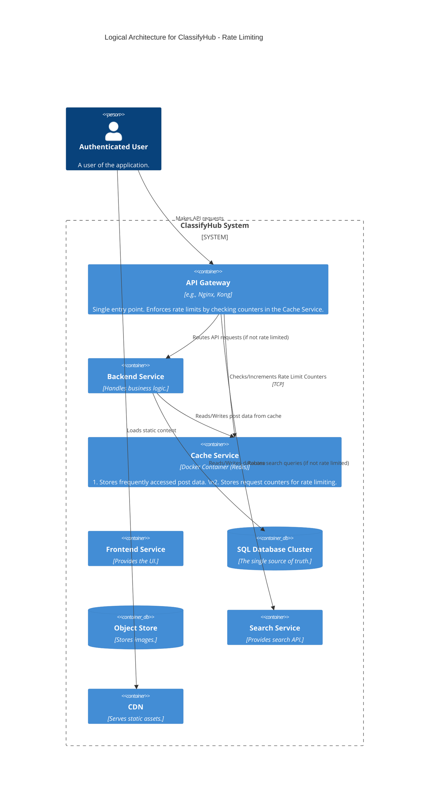
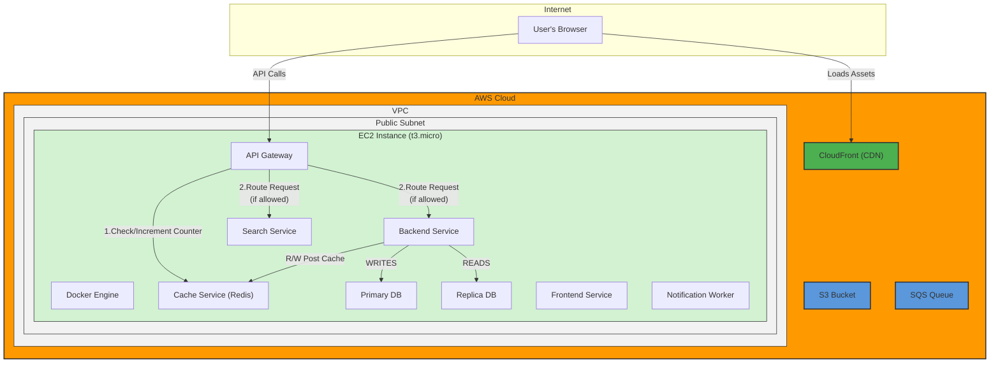

#### **ARCH-11: Add Rate Limiting at the API Gateway**

*   **Problem:** The API Gateway, as our single entry point, currently accepts an unlimited number of requests from any given client. This leaves our system vulnerable to various forms of abuse, including Denial-of-Service (DoS) attacks and runaway client scripts, which could overwhelm downstream services and degrade performance for all users (`NFR-4.4`).

*   **Solution:** We will enhance the existing **API Gateway** by adding rate-limiting logic. To do this efficiently, the gateway will use our existing **Cache Service** (Redis) as a high-speed counter. For each incoming API request, the gateway will:
    1.  Identify the client (e.g., by IP address).
    2.  Perform a quick check/increment operation in Redis to track the client's request count within a sliding time window.
    3.  If the count exceeds a predefined limit (e.g., 100 requests/minute), the gateway will immediately reject the request with a `429 Too Many Requests` HTTP status code, preventing it from ever reaching our backend services.

*   **Trade-offs:**
    *   **Pros:**
        *   **Enhanced Security & Stability:** Provides critical protection against simple DoS attacks and abusive clients, preserving system resources for legitimate users.
        *   **Resource Efficiency:** Leverages the existing Redis instance, avoiding the overhead of deploying and managing a separate service just for rate limiting.
        *   **Centralized Control:** The rate-limiting logic is managed in one central place (the gateway).
    *   **Cons:**
        *   **Shared Resource Contention:** We are now using the Redis instance for two distinct purposes (caching and rate limiting). Extremely high traffic could theoretically cause contention between these two functions.
        *   **Minor Latency Increase:** Adds a sub-millisecond network hop from the gateway to Redis for every request, which is a negligible but real performance cost.
        *   **Configuration Overhead:** Requires careful planning and tuning of the rate limits to avoid impacting legitimate, high-traffic users.

---

#### **Logical View (C4 Component Diagram)**

The logical view is updated to show a new critical dependency: the `API Gateway` now communicates with the `Cache Service` to enforce rate limits.

---

#### **Physical View (AWS Deployment Diagram)**

The physical view adds a new connection path from the `API Gateway Container` to the `Cache Service Container`.

---

#### **Component-to-Resource Mapping Table**

We update the roles of the `API Gateway` and `Cache Service`.

| Logical Component | Physical Resource | Rationale |
| :--- | :--- | :--- |
| **API Gateway** | Docker Container on a single EC2 Instance | Role updated to include rate-limiting logic, making it a more robust and secure entry point. |
| **Cache Service** | Docker Container (Redis) on a single EC2 Instance | Role updated to be dual-purpose: application-level caching for the backend and high-speed counting for the API gateway. This is a cost-effective use of an existing resource. |
| **... (Other components)** | ... (No change) | ... |
