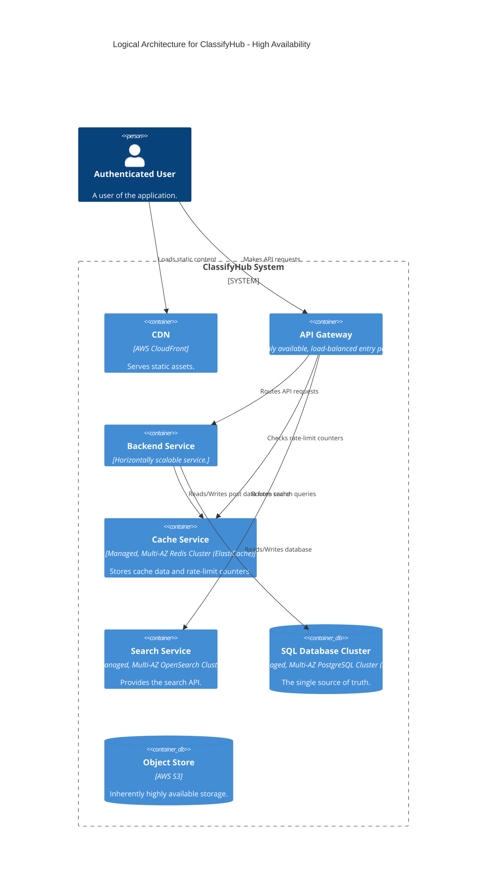
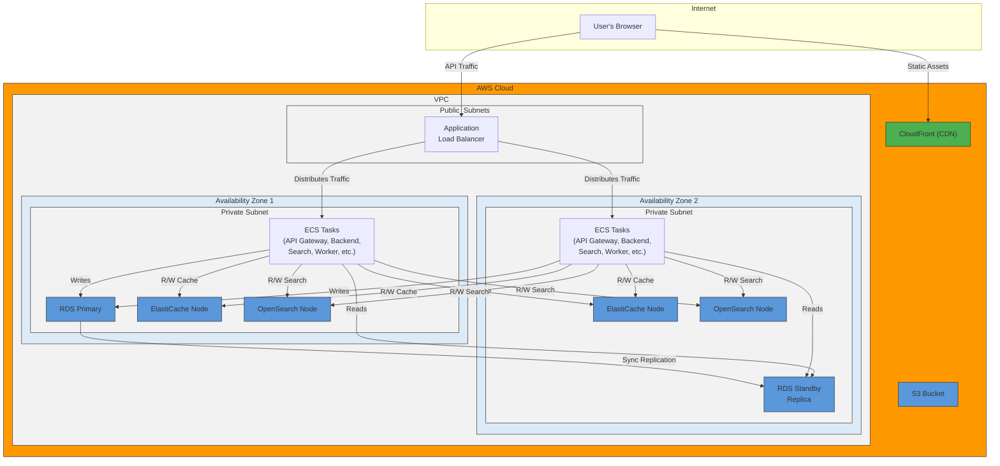

#### **ARCH-12: Design for High Availability (Multi-AZ Deployment)**

*   **Problem:** Our entire application and data tier is physically located on a single EC2 instance. The failure of this instance or its underlying Availability Zone (AZ) would result in a complete system outage. This design is a critical single point of failure and cannot meet our 99.9% uptime requirement (`NFR-3.1`).

*   **Solution:** We will re-architect the physical deployment to be fully redundant and fault-tolerant across multiple Availability Zones. This involves a fundamental shift from self-managed containers on a single host to a managed, distributed infrastructure.
    1.  **Introduce Container Orchestration:** We will replace the single Docker host with a managed container orchestrator like **AWS ECS (Elastic Container Service)**. This service will automatically distribute, manage, and scale our containerized services across EC2 instances in multiple AZs.
    2.  **Introduce Load Balancing:** An **Application Load Balancer (ALB)** will be placed in front of our services. The ALB will span multiple AZs, distribute incoming traffic to healthy container instances, and automatically route traffic away from any failed instance or AZ.
    3.  **Adopt Managed, Multi-AZ Data Services:** We will replace our self-hosted, containerized stateful services with their corresponding managed, multi-AZ AWS services:
        *   PostgreSQL -> **AWS RDS for PostgreSQL (Multi-AZ)**
        *   Redis -> **AWS ElastiCache for Redis (Multi-AZ)**
        *   Elasticsearch -> **AWS OpenSearch Service (Multi-AZ)**
    4.  **Implement Secure Networking:** The VPC will be properly structured with **public subnets** for the load balancer and **private subnets** for our application containers and databases, significantly enhancing security.

*   **Trade-offs:**
    *   **Pros:**
        *   **High Availability:** The system can now survive the failure of an entire data center (AZ), which is the standard industry practice for achieving high uptime SLAs.
        *   **True Scalability:** The orchestrator and load balancer allow for genuine horizontal scaling of all stateless services.
        *   **Reduced Operational Overhead:** Using managed services (RDS, ElastiCache, OpenSearch) offloads the immense complexity of database replication, patching, and failover management to AWS.
        *   **Enhanced Security:** Placing containers and databases in private subnets drastically reduces the system's direct attack surface.
    *   **Cons:**
        *   **Significant Cost Increase:** This architecture is inherently more expensive due to redundant infrastructure and the use of premium managed services.
        *   **Major Complexity Increase:** We are moving from a simple, single-host model to a truly distributed system. This requires more sophisticated deployment processes, monitoring, and debugging skills.

---

#### **Logical View (C4 Component Diagram)**

The logical view remains largely the same, as the components and their responsibilities haven't changed. However, their descriptions are updated to reflect their new, highly-available nature.

---

#### **Physical View (AWS Deployment Diagram)**

This diagram is a complete redesign, representing our new, highly available production architecture.

---

#### **Component-to-Resource Mapping Table**

Every component mapping is updated to a highly available, and in most cases, managed service.

| Logical Component | Physical Resource | Rationale |
| :--- | :--- | :--- |
| **Stateless Services** (API Gateway, Frontend, Backend, Search, Worker) | **AWS ECS Tasks** running on Fargate/EC2 across multiple AZs, behind an **Application Load Balancer**. | The orchestrator and load balancer provide scalability and high availability by automatically distributing containers and traffic across healthy AZs. |
| **SQL Database Cluster** | **AWS RDS for PostgreSQL (Multi-AZ)** | A managed service that automates replication, failover, and patching. The Multi-AZ configuration provides a hot standby in a different AZ for high availability. |
| **Cache Service** | **AWS ElastiCache for Redis (Multi-AZ)** | A managed, distributed Redis cluster that provides high-speed caching with failover capabilities across AZs. |
| **Search Service** | **AWS OpenSearch Service (Multi-AZ)** | A managed Elasticsearch/OpenSearch cluster that distributes data and handles node failures across multiple AZs for high availability. |
