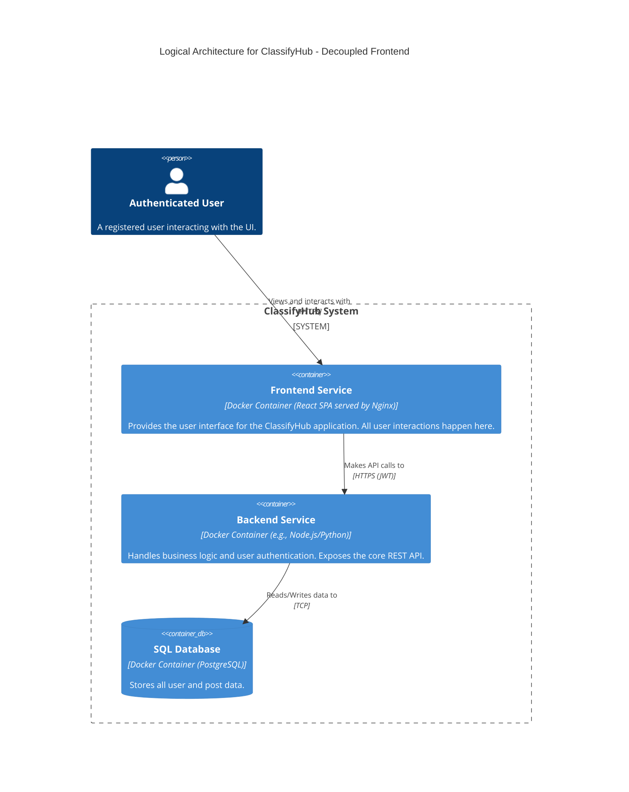
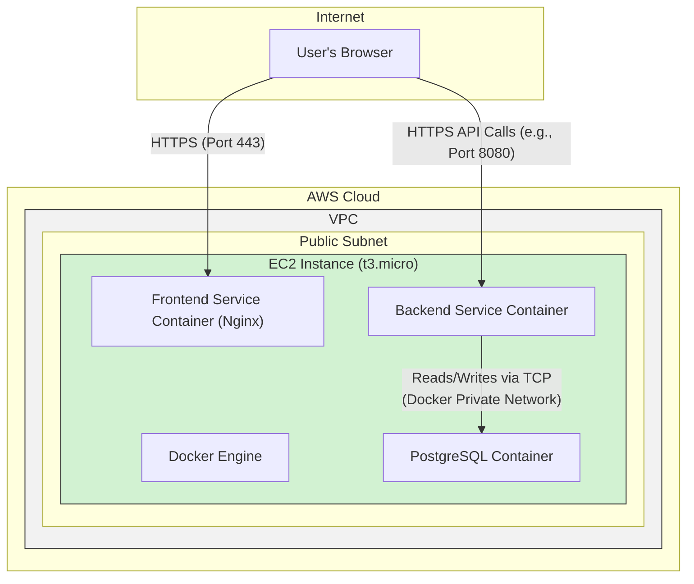

#### **ARCH-3: Decouple Frontend Application**

*   **Problem:** Currently, there is no defined user interface. The `Backend Service` is a standalone API, which is insufficient for a user to interact with the application as per the PRD (`FR-3.1.1`). We need a dedicated frontend to provide the user experience.

*   **Solution:** Introduce a new container: a **Frontend Service**. This will be a Single-Page Application (SPA), for example, built with React and served by a lightweight web server like Nginx. This service will be responsible for all UI rendering. It will run as a separate container but, for now, will be co-located on the same EC2 instance as the other services. The `User` will now interact with the `Frontend Service`, which in turn makes API calls to the `Backend Service`.

*   **Trade-offs:**
    *   **Pros:**
        *   **Separation of Concerns:** Frontend and backend development can happen independently, allowing for specialized teams and faster iteration.
        *   **Improved User Experience:** An SPA provides a modern, responsive user experience compared to server-side rendered pages.
        *   **Clear API Contract:** Forces a well-defined API between the client and server.
    *   **Cons:**
        *   **Increased Complexity:** We now have two services to build, deploy, and manage instead of one.
        *   **Co-located Deployment:** While logically separate, they still share the same underlying hardware in this design, meaning they are not physically isolated and a resource contention issue could affect both.

---

#### **Logical View (C4 Component Diagram)**

This diagram introduces the new `Frontend Service` as the primary point of interaction for the user.

---

#### **Physical View (AWS Deployment Diagram)**

The physical view evolves to include the new `Frontend Service` container running on the same EC2 instance. The user's browser now connects to the frontend container, which then communicates with the backend container.

---

#### **Component-to-Resource Mapping Table**

We add the new `Frontend Service` to our mapping table.

| Logical Component | Physical Resource | Rationale |
| :--- | :--- | :--- |
| **Frontend Service** | Docker Container (Nginx) on a single EC2 Instance | A lightweight Nginx container is efficient for serving static SPA assets. Co-locating it on the same EC2 instance is cost-effective and maintains simplicity for this stage. |
| **Backend Service** | Docker Container on a single EC2 Instance | No change in resource. It now serves an internal API role for the frontend. |
| **SQL Database** | Docker Container (PostgreSQL) on the same EC2 Instance | No change. It remains the single source of truth for data. |
