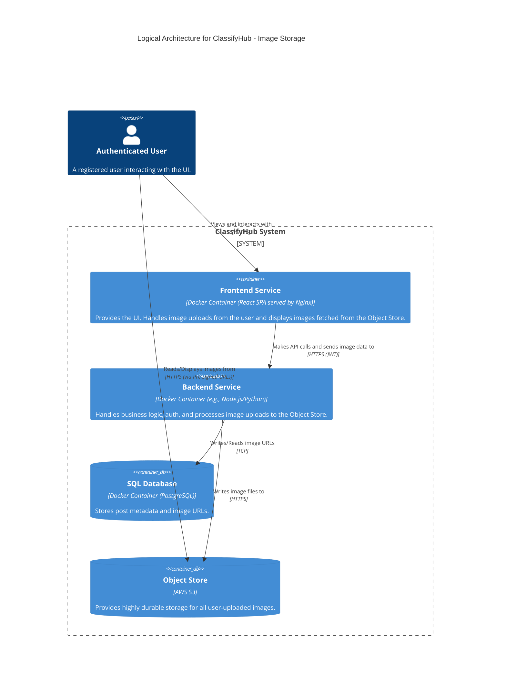
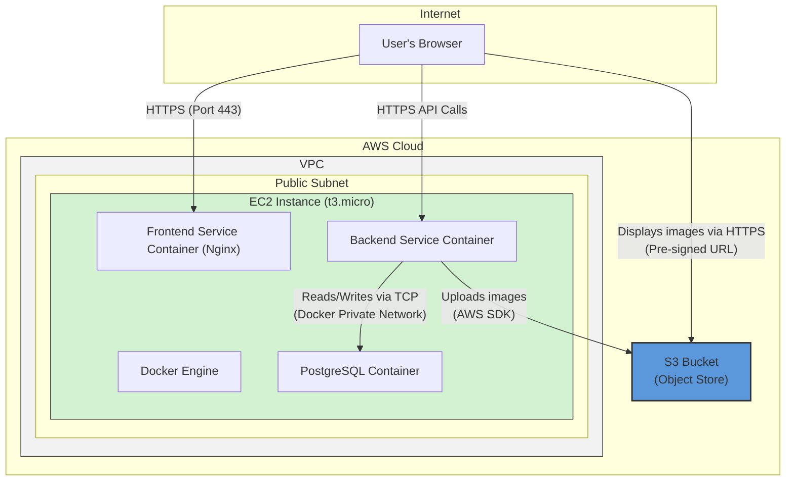

#### **ARCH-4: Add Object Storage for Image Uploads**

*   **Problem:** The current architecture only supports text-based data, but the PRD (`FR-2.2.1`) requires users to upload images with their posts. Storing binary files (images) directly in the SQL database is highly inefficient, does not scale, and would dramatically increase storage costs and database load.

*   **Solution:** We will introduce a dedicated, managed **Object Storage** service (AWS S3) to handle image persistence. The `Backend Service` will be responsible for processing image uploads from the client; it will securely upload the file to a private S3 bucket and then store only the resulting object URL or key in the `SQL Database` alongside the post data. When a user views a post, the `Frontend Service` will receive the image URL from the `Backend Service` and render the image by sourcing it directly from S3 (using a pre-signed URL for security).

*   **Trade-offs:**
    *   **Pros:**
        *   **Right Tool for the Job:** S3 is highly durable, scalable, and cost-effective for storing and serving large files, offloading this responsibility from our application server and database.
        *   **Improved Performance:** Decouples image storage from the main application, allowing both to be optimized and scaled independently.
        *   **Enhanced Security:** By handling uploads via the backend, the S3 bucket can remain private and inaccessible to the public internet, with the backend granting temporary access via pre-signed URLs.
    *   **Cons:**
        *   **Increased Complexity:** Introduces a new external cloud service (S3) and a new data flow that must be managed and secured.
        *   **Backend Upload Bottleneck:** The chosen server-side upload flow adds load (CPU, memory, bandwidth) to the backend service. This is a conscious trade-off for better security, but it's a potential bottleneck we must address in later scaling stages.

---

#### **Logical View (C4 Component Diagram)**

The logical view now includes the Object Store. The `Backend Service` acts as the writer, while the `User` (via their browser) is the ultimate reader of the image data.

---

#### **Physical View (AWS Deployment Diagram)**

The physical view is updated to include the AWS S3 service, which exists outside our EC2 instance but within the AWS Cloud.

---

#### **Component-to-Resource Mapping Table**

We add the new `Object Store` to our mapping table.

| Logical Component | Physical Resource | Rationale |
| :--- | :--- | :--- |
| **Frontend Service** | Docker Container (Nginx) on a single EC2 Instance | No change. It will be updated to handle file upload forms. |
| **Backend Service** | Docker Container on a single EC2 Instance | No change in resource. It will be updated to include the AWS SDK and logic for handling S3 uploads. |
| **SQL Database** | Docker Container (PostgreSQL) on the same EC2 Instance | No change. Its schema will be updated to include a column for image URLs/keys. |
| **Object Store** | AWS S3 Bucket | A highly durable, scalable, and cost-effective managed service ideal for storing and serving large binary files like images, offloading this burden from the application server. |
