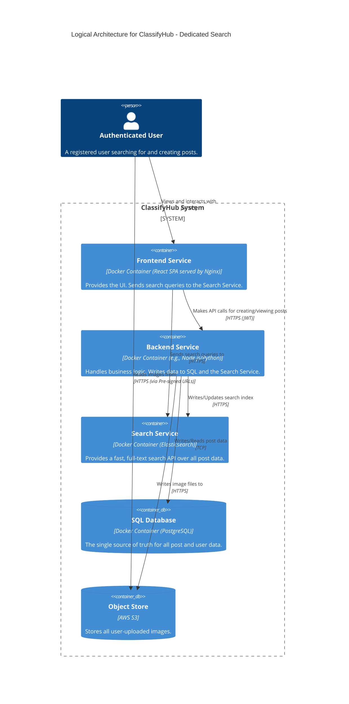
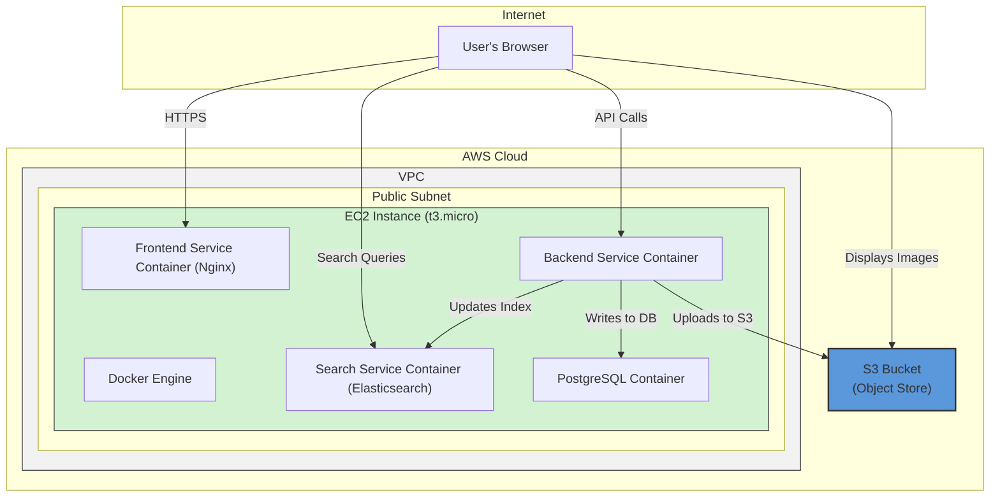

#### **ARCH-5: Implement Dedicated Search Service**

*   **Problem:** The PRD requires users to perform keyword searches on posts (`FR-3.2.1`). Relying on the SQL database for full-text search (e.g., using `LIKE '%query%'` clauses) is inefficient, does not scale, and provides a poor user experience. This approach would quickly become a major performance bottleneck.

*   **Solution:** Introduce a dedicated **Search Service** using a specialized search engine like Elasticsearch. This service will maintain an optimized index of post data (title, description, etc.). When a post is created or updated, the `Backend Service` will perform a "dual write," sending the data to both the `SQL Database` for persistent storage and to the `Search Service` for indexing. All search queries from the `Frontend Service` will be sent directly to the `Search Service`'s API, completely isolating the search workload from the primary database.

*   **Trade-offs:**
    *   **Pros:**
        *   **High Performance:** Elasticsearch is purpose-built for fast, complex full-text search, providing a vastly superior experience.
        *   **Decoupled Workloads:** Separates the read-intensive search traffic from the transactional workload of the main database, allowing each to be scaled and optimized independently.
        *   **Advanced Features:** Enables features like relevance scoring, faceting, and suggestions which are difficult to implement with SQL.
    *   **Cons:**
        *   **Data Consistency Challenge:** Using a "dual write" strategy introduces the risk of data becoming inconsistent if one write succeeds and the other fails. For now, we accept this risk for simplicity, but a more robust system might require a Change Data Capture (CDC) pipeline.
        *   **Increased Operational Complexity:** Adds another complex, stateful service to our architecture that requires deployment, monitoring, and maintenance.

---

#### **Logical View (C4 Component Diagram)**

The logical view now incorporates the `Search Service`, showing how it integrates into both the read (search) and write (indexing) paths.

---

#### **Physical View (AWS Deployment Diagram)**

We add the new `Search Service` container to our single EC2 instance, keeping the deployment simple.

---

#### **Component-to-Resource Mapping Table**

We add the new `Search Service` to our mapping table.

| Logical Component | Physical Resource | Rationale |
| :--- | :--- | :--- |
| **Frontend Service** | Docker Container (Nginx) on a single EC2 Instance | No change. It will be updated to include a search UI and API calls to the new service. |
| **Backend Service** | Docker Container on a single EC2 Instance | No change in resource. It will be updated to perform dual writes to the database and search service. |
| **Search Service** | Docker Container (Elasticsearch) on a single EC2 Instance | Elasticsearch is a powerful, industry-standard search engine. Running it as a container on the same host maintains simplicity and is cost-effective for this stage. |
| **SQL Database** | Docker Container (PostgreSQL) on the same EC2 Instance | No change. Remains the primary source of truth. |
| **Object Store** | AWS S3 Bucket | No change. |
