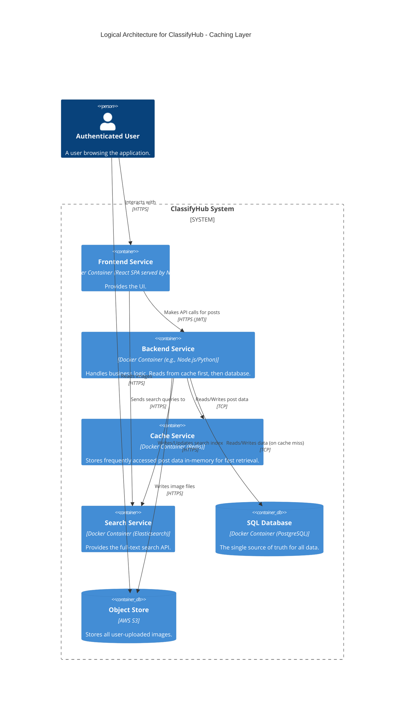
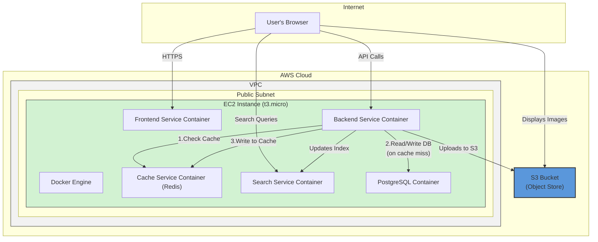

#### **ARCH-6: Add a Distributed Caching Layer**

*   **Problem:** The system currently relies on the `SQL Database` for all non-search data retrieval. As traffic increases, especially for popular posts, this will lead to high read load, increased latency, and will prevent us from meeting the P99 latency requirement of under 1 second (`NFR-1.1`). The database will become the primary system bottleneck.

*   **Solution:** Introduce a new, dedicated **Cache Service** using a distributed in-memory datastore like Redis. The `Backend Service` will implement a "cache-aside" pattern. When a request for a post is received, the backend will first check the cache.
    *   **Cache Hit:** If the post is in the cache, it is returned directly to the user for a very fast response.
    *   **Cache Miss:** If the post is not in the cache, the backend will query the `SQL Database`, store the result in the cache with a Time-To-Live (TTL), and then return the data. Subsequent requests for that same post will now be cache hits.

*   **Trade-offs:**
    *   **Pros:**
        *   **Massively Improved Latency:** Serving data from memory (Redis) is significantly faster than from a disk-based database, directly addressing our P99 goal.
        *   **Reduced Database Load:** The cache will absorb a large portion of the read traffic, protecting the database and improving its performance on essential write operations.
        *   **Increased Scalability:** Provides a major boost to the read scalability of the entire system.
    *   **Cons:**
        *   **Data Staleness:** The data in the cache can be out-of-date if the source data in the SQL database changes. Using a short TTL (e.g., 5-10 minutes) is a simple initial strategy to mitigate this, but it's not perfect. A more complex cache invalidation strategy (e.g., on write) would be needed for real-time consistency.
        *   **Increased Complexity:** Introduces another stateful service into our architecture that requires deployment, monitoring, and maintenance.

---

#### **Logical View (C4 Component Diagram)**

The logical view now includes the `Cache Service`, showing how it sits between the `Backend Service` and the `SQL Database` for read operations.

---

#### **Physical View (AWS Deployment Diagram)**

We add the new `Cache Service` container to our single EC2 instance.

---

#### **Component-to-Resource Mapping Table**

We add the new `Cache Service` to our mapping table.

| Logical Component | Physical Resource | Rationale |
| :--- | :--- | :--- |
| **Frontend Service** | Docker Container (Nginx) on a single EC2 Instance | No change. |
| **Backend Service** | Docker Container on a single EC2 Instance | No change in resource. It will be updated to include a Redis client and the cache-aside logic. |
| **Cache Service** | Docker Container (Redis) on a single EC2 Instance | Redis is an industry-standard, high-performance in-memory cache. Running it as a container on the same host is the simplest deployment for this stage. |
| **Search Service** | Docker Container (Elasticsearch) on a single EC2 Instance | No change. |
| **SQL Database** | Docker Container (PostgreSQL) on the same EC2 Instance | No change. |
| **Object Store** | AWS S3 Bucket | No change. |
