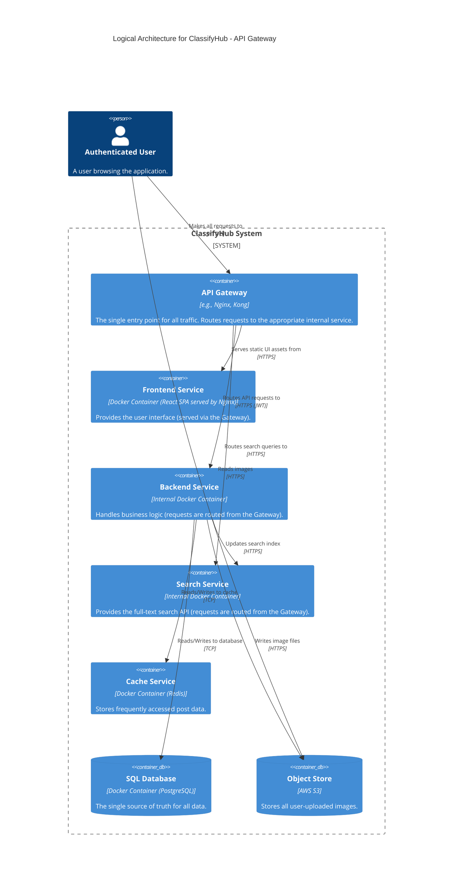
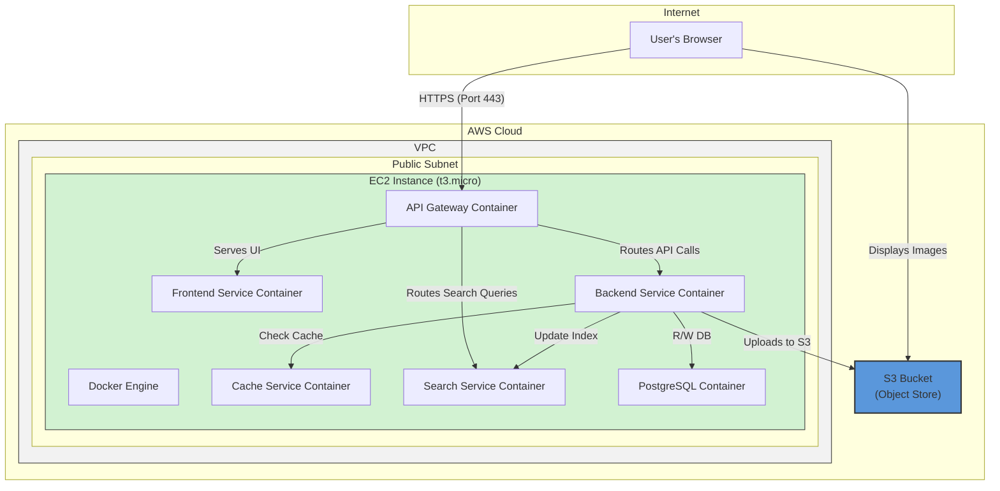

#### **ARCH-7: Introduce an API Gateway**

*   **Problem:** Our current architecture exposes multiple services (`Frontend`, `Backend`, `Search`) directly to the internet. This forces the client (the user's browser) to know the addresses of multiple services, which is brittle and complex. It also creates a large attack surface and lacks a centralized location for handling cross-cutting concerns like SSL termination, rate limiting, and request logging.

*   **Solution:** Introduce an **API Gateway** as the single entry point for all incoming traffic. This gateway will act as a reverse proxy. The user's browser will only ever communicate with the API Gateway. The gateway will then be responsible for:
    1.  Serving the static assets of the **Frontend Service**.
    2.  Routing API requests (e.g., `/api/posts/*`) to the **Backend Service**.
    3.  Routing search requests (e.g., `/api/search/*`) to the **Search Service**.
    This simplifies the client logic, reduces the attack surface by hiding internal services, and provides a single control point for future enhancements.

*   **Trade-offs:**
    *   **Pros:**
        *   **Single Entry Point:** Simplifies client configuration and network security rules.
        *   **Centralized Concerns:** Provides a single place to manage SSL, authentication checks, rate limiting, and logging.
        *   **Decoupling:** Hides the internal service architecture from the client, allowing us to refactor or move services without impacting the user.
    *   **Cons:**
        *   **New Component to Manage:** Adds another piece of infrastructure that needs to be configured, deployed, and monitored.
        *   **Potential Bottleneck / Single Point of Failure:** All traffic now flows through the gateway. If it is not configured for high availability and performance (which we will address in later issues), it can become a critical failure point.

---

#### **Logical View (C4 Component Diagram)**

The logical view now includes the `API Gateway`, which sits at the edge of the system and mediates all communication.

---

#### **Physical View (AWS Deployment Diagram)**

The physical view is significantly cleaned up. All traffic from the user's browser now targets the `API Gateway Container`.

---

#### **Component-to-Resource Mapping Table**

We add the new `API Gateway` to our mapping table.

| Logical Component | Physical Resource | Rationale |
| :--- | :--- | :--- |
| **API Gateway** | Docker Container (e.g., Nginx, Kong) on a single EC2 Instance | Centralizes ingress traffic, providing a single point of control for routing, security, and other cross-cutting concerns. Co-locating it maintains simplicity for this stage. |
| **Frontend Service** | Docker Container (Nginx) on a single EC2 Instance | No change. Now an internal service whose assets are served via the gateway. |
| **Backend Service** | Docker Container on a single EC2 Instance | No change. Now an internal service, reducing its direct exposure to the internet. |
| **Cache Service** | Docker Container (Redis) on a single EC2 Instance | No change. |
| **Search Service** | Docker Container (Elasticsearch) on a single EC2 Instance | No change. Now an internal service, reducing its direct exposure. |
| **SQL Database** | Docker Container (PostgreSQL) on the same EC2 Instance | No change. |
| **Object Store** | AWS S3 Bucket | No change. |
