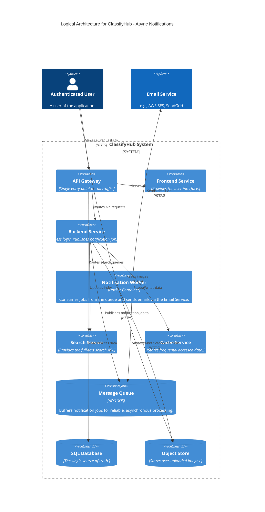
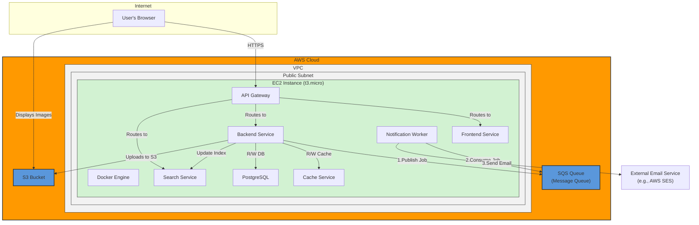

#### **ARCH-8: Implement Asynchronous Notification System**

*   **Problem:** The system needs to send emails for actions like post renewal reminders (`FR-2.1.5`) and poster contact forms (`FR-3.3.1`). Performing these actions synchronously within an API request would make the API slow and unreliable. If a third-party email service is down or slow, the user's request will hang or fail, leading to a poor user experience.

*   **Solution:** We will implement an asynchronous notification system. The `Backend Service` will no longer attempt to send emails directly. Instead, it will publish a message containing the notification details (e.g., recipient, type, content) to a **Message Queue** (like AWS SQS). We will introduce a new, independent **Notification Worker Service**. This service's only job is to poll the queue for new messages, process them, and make the actual API call to a third-party **Email Service** (like AWS SES). This decouples the core API from the unreliable task of sending emails.

*   **Trade-offs:**
    *   **Pros:**
        *   **Improved API Performance:** User-facing API responses are now immediate, as the backend only needs to perform a quick write to the queue.
        *   **Increased Reliability:** If the email service is down, messages are safely stored in the queue and can be processed when the service recovers. This prevents lost notifications.
        *   **Decoupling & Scalability:** The notification logic is now a separate service that can be maintained and scaled independently of the main backend.
    *   **Cons:**
        *   **Eventual Consistency:** The user receives a success response before the email is actually sent. This is perfectly acceptable for notifications.
        *   **Increased Complexity:** Introduces two new architectural components: the message queue and the worker service, which add to the operational overhead.

---

#### **Logical View (C4 Component Diagram)**

The logical view now includes the `Message Queue` and the `Notification Worker`, as well as the external `Email Service`.

---

#### **Physical View (AWS Deployment Diagram)**

The physical view adds the new `Notification Worker` container to the EC2 instance and the `Message Queue` (SQS) as a managed AWS service.

---

#### **Component-to-Resource Mapping Table**

We add the new components to our mapping table.

| Logical Component | Physical Resource | Rationale |
| :--- | :--- | :--- |
| **API Gateway** | Docker Container on a single EC2 Instance | No change. |
| **Frontend Service** | Docker Container on a single EC2 Instance | No change. |
| **Backend Service** | Docker Container on a single EC2 Instance | No change in resource. Updated to publish messages instead of sending emails. |
| **Notification Worker Service** | Docker Container on a single EC2 Instance | A new, lightweight service. Co-locating it is simple and cost-effective at this stage. It can be scaled separately later if needed. |
| **Message Queue** | AWS SQS (Simple Queue Service) | A fully managed, highly available, and scalable message queue service that perfectly suits our need to decouple the notification workload reliably. |
| **Cache Service** | Docker Container (Redis) on a single EC2 Instance | No change. |
| **Search Service** | Docker Container (Elasticsearch) on a single EC2 Instance | No change. |
| **SQL Database** | Docker Container (PostgreSQL) on the same EC2 Instance | No change. |
| **Object Store** | AWS S3 Bucket | No change. |
