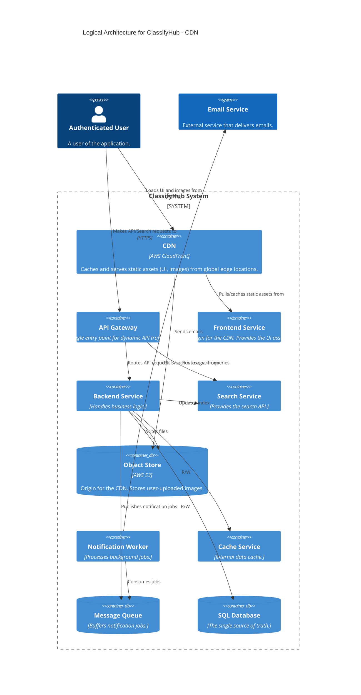
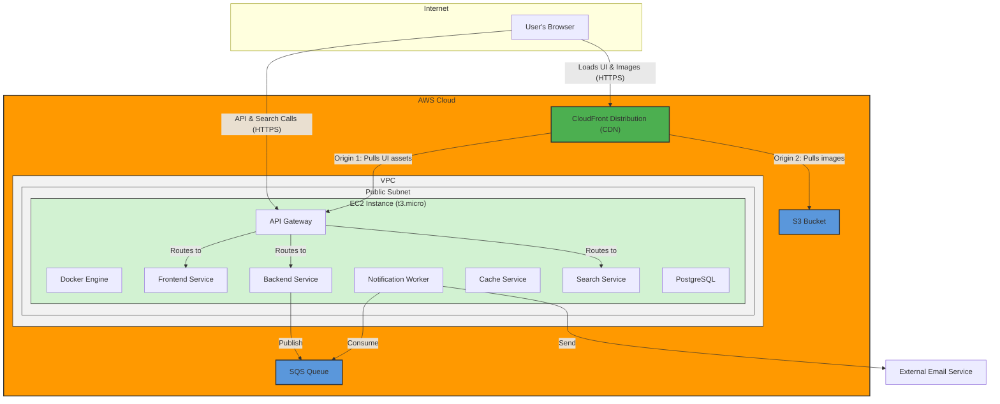

#### **ARCH-9: Integrate a Content Delivery Network (CDN)**

*   **Problem:** Our application's static assets (JavaScript, CSS from the `Frontend Service`) and user-uploaded images (from the `Object Store`) are served from a single geographic region. This will result in high latency and a poor user experience for users located far from our server's location.

*   **Solution:** We will introduce a **Content Delivery Network (CDN)**, specifically AWS CloudFront. The CDN will cache our static content at edge locations around the world, physically closer to our users.
    1.  A CloudFront distribution will be configured with the **API Gateway** as its origin for serving the frontend application's static assets.
    2.  A second CloudFront "behavior" will be configured with the **S3 Bucket** as its origin for serving user-uploaded images.
    End users will now download these assets from a nearby CDN edge location, dramatically reducing latency.

*   **Trade-offs:**
    *   **Pros:**
        *   **Drastically Reduced Latency:** Users worldwide will experience significantly faster load times for the UI and images.
        *   **Reduced Origin Load:** The CDN absorbs the vast majority of traffic for static assets, reducing the load and data transfer costs from our EC2 instance and S3 bucket.
        *   **Enhanced Reliability & Security:** Provides an additional layer of caching and DDoS protection.
    *   **Cons:**
        *   **Cache Invalidation Complexity:** When we deploy a new version of the frontend, we must invalidate the CDN cache to ensure users see the latest version. This adds a step to our deployment process.
        *   **Increased Cost:** While often offset by reduced data transfer costs from the origin, a CDN is an additional service with its own pricing.

---

#### **Logical View (C4 Component Diagram)**

The logical view now shows the `CDN` as the primary point of contact for the user for all static content. API calls still go through the `API Gateway`.

---

#### **Physical View (AWS Deployment Diagram)**

The physical view now clearly separates traffic. Static content requests go to CloudFront, while dynamic API requests go to the API Gateway.

---

#### **Component-to-Resource Mapping Table**

We add the new `CDN` component to our mapping table.

| Logical Component | Physical Resource | Rationale |
| :--- | :--- | :--- |
| **CDN** | AWS CloudFront | A global, managed CDN that caches content close to users. This is the most effective way to reduce latency for static assets (UI files, images) for a worldwide audience. |
| **API Gateway** | Docker Container on a single EC2 Instance | No change. Now handles only dynamic API traffic. |
| **Frontend Service** | Docker Container on a single EC2 Instance | No change in resource, but is now an "origin" for the CDN. |
| **Object Store** | AWS S3 Bucket | No change in resource, but is now an "origin" for the CDN. |
| **... (Other components)** | ... (No change) | ... |
