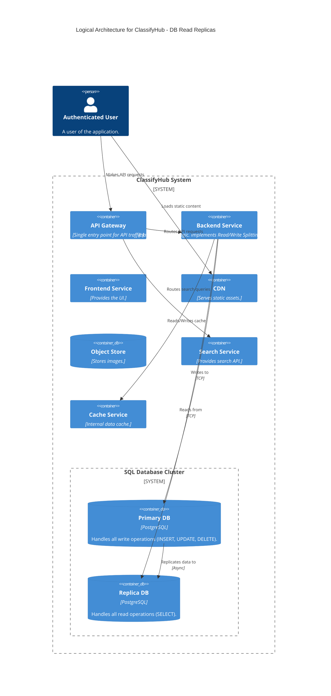
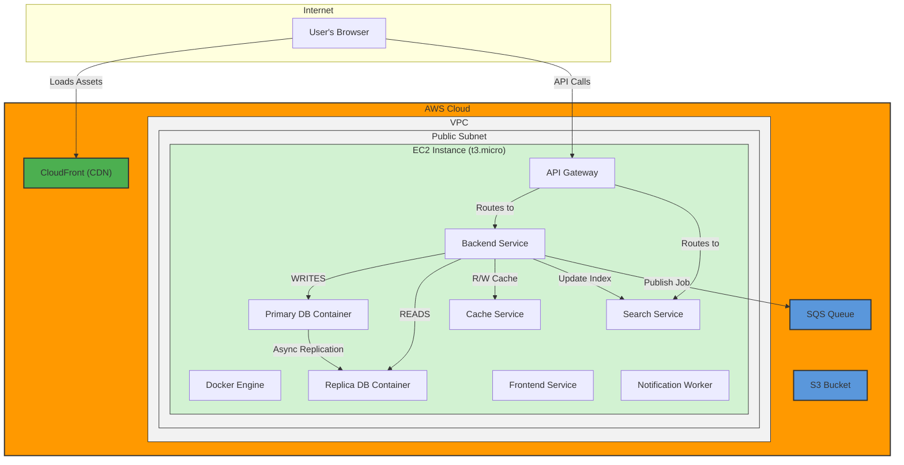

#### **ARCH-10: Scale the Database with Read Replicas**

*   **Problem:** Our single `SQL Database` container is a critical single point of failure and a performance bottleneck. It cannot handle the high volume of read requests required (`NFR-2.2`) while simultaneously processing writes without performance degradation and increased latency.

*   **Solution:** We will evolve the database from a single instance into a **Primary-Replica (Leader-Follower) Cluster**.
    *   A **Primary DB** instance will handle all write operations (INSERT, UPDATE, DELETE).
    *   A new **Replica DB** instance will be configured to asynchronously replicate data from the primary and will handle the majority of the application's read traffic (SELECT queries).
    *   The `Backend Service` will be updated to implement read/write splitting, directing all write queries to the primary and all read queries to the replica. This separates the workloads, allowing us to scale reads independently.

*   **Trade-offs:**
    *   **Pros:**
        *   **Read Scalability:** Dramatically increases our capacity for handling read requests. We can add more replicas in the future as read traffic grows.
        *   **Improved Performance:** Offloading the read workload allows the primary database to dedicate its resources to writes, reducing lock contention and improving overall throughput.
        *   **Increased Availability:** The replica serves as a warm standby. If the primary fails, a replica can be promoted to take its place (manual failover at this stage), reducing downtime.
    *   **Cons:**
        *   **Replication Lag:** Data written to the primary is not instantly available on the replica. This introduces a small window of eventual consistency, which is an acceptable trade-off for this application (e.g., a new post taking a few hundred milliseconds to appear in listings).
        *   **Increased Complexity:** We are now managing a distributed data system. The application's data access logic also becomes more complex to handle the read/write splitting.

---

#### **Logical View (C4 Component Diagram)**

The single `SQL Database` container is now replaced by a `Database Cluster` containing a `Primary` and a `Replica` instance, showing the separated read/write paths.

---

#### **Physical View (AWS Deployment Diagram)**

The physical view now shows two database containers inside the EC2 instance, with the backend container connecting to both.

---

#### **Component-to-Resource Mapping Table**

We update the entry for the `SQL Database` to reflect its new cluster configuration.

| Logical Component | Physical Resource | Rationale |
| :--- | :--- | :--- |
| **SQL Database Cluster** | Two Docker Containers (PostgreSQL) on the same EC2 Instance | Evolving to a Primary-Replica model is a standard pattern for scaling database reads. For now, co-locating both containers on the same host is a simplification. In a truly HA setup (future issue), these would be on separate hosts. |
| **... (Other components)** | ... (No change) | ... |
