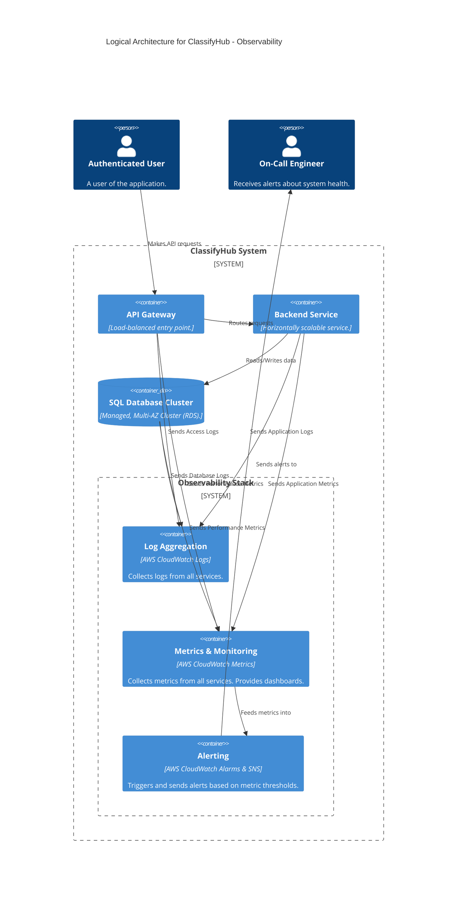
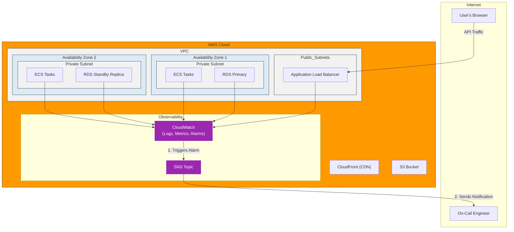

#### **ARCH-13: Implement a Centralized Observability Stack**

*   **Problem:** Our system is now a complex, distributed application. When issues occur, it's nearly impossible to trace problems across multiple services, containers, and managed resources. We have no centralized way to view logs, monitor performance metrics, or receive alerts, failing to meet our maintainability and operational requirements (`NFR-5.1`, `5.2`, `5.3`).

*   **Solution:** We will introduce a dedicated, managed **Observability Stack** using AWS services. This stack will centralize the three pillars of observability:
    1.  **Logging:** All services (ECS tasks, Lambda functions, etc.) will be configured to stream their logs to **AWS CloudWatch Logs**. This provides a central place to search and analyze logs from the entire system.
    2.  **Metrics:** All AWS resources (ALB, ECS, RDS, ElastiCache, etc.) will automatically publish performance metrics to **AWS CloudWatch Metrics**. We will create consolidated dashboards in CloudWatch to visualize system health.
    3.  **Alerting:** We will create **AWS CloudWatch Alarms** that trigger on specific metric thresholds (e.g., API latency > 1s, 5xx error rate > 1%, RDS CPU > 80%). These alarms will publish a message to an **AWS Simple Notification Service (SNS)** topic, which can then notify the on-call team via email, SMS, or other channels.

*   **Trade-offs:**
    *   **Pros:**
        *   **Deep System Insight:** Provides the essential tools to monitor, debug, and understand the behavior of our distributed system in real-time.
        *   **Faster Incident Response:** Centralized data and automated alerts drastically reduce the Mean Time To Detect (MTTD) and Mean Time To Resolve (MTTR) for production issues.
        *   **Managed Service Benefits:** Using CloudWatch and SNS is highly reliable and removes the significant operational burden of building, scaling, and maintaining our own complex observability infrastructure.
    *   **Cons:**
        *   **Cost:** CloudWatch pricing is based on data ingestion, storage, and queries. This is a necessary but additional operational cost.
        *   **Vendor Lock-in:** Deeply integrating with a specific cloud provider's observability suite can make future migrations to other clouds more complex.

---

#### **Logical View (C4 Component Diagram)**

The logical view introduces the `Observability Stack` as a cross-cutting concern that receives data from all other system components and sends alerts to an `On-Call Engineer`.

---

#### **Physical View (AWS Deployment Diagram)**

The physical view shows how the managed observability services sit alongside our VPC and collect data from all the resources within it.

---

#### **Component-to-Resource Mapping Table**

We add the new `Observability Stack` to our mapping table.

| Logical Component | Physical Resource | Rationale |
| :--- | :--- | :--- |
| **Observability Stack** | **AWS CloudWatch** (Logs, Metrics, Alarms) and **AWS SNS** | A suite of tightly integrated, managed services that provide a comprehensive observability solution out-of-the-box. This is the most efficient and reliable way to gain deep insight into our AWS-based distributed system. |
| **... (Other components)** | ... (No change in resources, but now configured to export logs/metrics) | ... |
