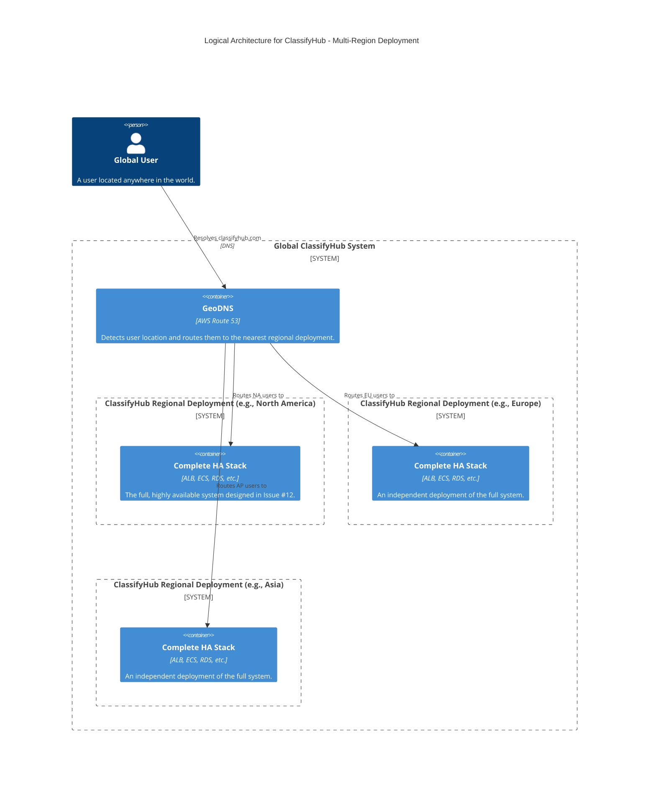
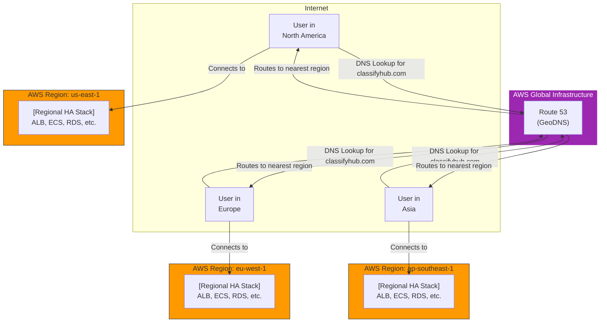

#### **ARCH-14: Implement Geo-Partitioning and Routing**

*   **Problem:** While our system is highly available within a single AWS region, it will provide a high-latency experience for users located on different continents. Furthermore, it cannot meet potential data residency requirements (e.g., GDPR) that mandate storing user data within a specific geographic area.

*   **Solution:** We will evolve the architecture into a fully **multi-region, geo-partitioned deployment**.
    1.  **Replicate the Regional Stack:** The entire highly available, multi-AZ architecture we designed in Issue #12 will be treated as a "regional stamp" and deployed into multiple AWS regions (e.g., North America, Europe, Asia).
    2.  **Introduce GeoDNS:** We will use **Amazon Route 53** with a **geolocation routing policy**. This is a smart DNS service that will detect where a user's request originates from and automatically route them to the AWS region that is geographically closest, ensuring the lowest possible latency.
    3.  **Partition Data:** Each regional deployment will be self-contained and will operate on its own independent dataset. For example, a user routed to the `eu-west-1` (Ireland) region will only see and create posts within that region's database.

*   **Trade-offs:**
    *   **Pros:**
        *   **Optimal Global Performance:** Users are always served from the nearest data center, providing the fastest possible experience.
        *   **Data Residency Compliance:** Natively supports requirements to keep a region's data within that region.
        *   **Ultimate Fault Tolerance:** Provides a disaster recovery solution, as the system can withstand the failure of an entire AWS region.
    *   **Cons:**
        *   **Highest Cost and Complexity:** This is the most complex and expensive architecture to operate, as it involves managing multiple, independent deployments of the entire stack.
        *   **Partitioned User Experience:** By default, users in one region cannot see data from another. Implementing cross-region search or data sharing is a significant undertaking and is considered out of scope for this design.

---

#### **Logical View (C4 Component Diagram)**

The logical view is elevated to show the global scale. A new `GeoDNS` component now sits in front of multiple, identical `ClassifyHub Regional Deployment` systems.

---

#### **Physical View (AWS Deployment Diagram)**

This is our highest-level physical view, abstracting the details of each regional stack to focus on the global routing pattern.

---

#### **Component-to-Resource Mapping Table**

We add our final component and update the system's overall description.

| Logical Component | Physical Resource | Rationale |
| :--- | :--- | :--- |
| **GeoDNS** | **AWS Route 53** with Geolocation Routing Policy | A highly available and scalable managed DNS service. Its geolocation routing feature is the ideal tool for directing users to the lowest-latency regional endpoint. |
| **ClassifyHub Regional Deployment** | The entire Multi-AZ architecture from Issue #12, deployed as a stamp in multiple AWS Regions. | Replicating the entire stack ensures that each region is independent, resilient, and provides the full set of application features to its local users. |
